# 与三阶段无关

## html的属性是什么？作用是什么？

属性就是给html添加特殊的功能

语法：

卸载开标签中    属性="属性值"


## bootstrap

获取： npm install --save bootstrap@3


# 框架

## ui框架

就是写页面的  让写页面的效率更高

## js框架


## 事件循环

### 事件循环的基本概念

js在设计之初是单线程的  但是要处理一些等待时间较长的操作的时候就会比较麻烦  所以js需要有异步操作来解决这个等待事件较长的问题

但是要实现异步操作那么就要有一个机制来处理异步问题 所以 事件循环就是来处理异步操作的机制

### 事件循环的分类

事件循环就是异步操作的机制  那么异步操作也有优先级

宏任务与微任务（优先级高）

宏任务：定时器

微任务:promise

## 原型设计

墨客  墨刀 蓝狐 ..........


### async await 使用

async 中文异步的意思   他是promise的语法糖（糖衣语法 用简单的语法来描述一个内容）

````html
<!DOCTYPE html>
<html lang="en">
<head>
    <meta charset="UTF-8">
    <meta http-equiv="X-UA-Compatible" content="IE=edge">
    <meta name="viewport" content="width=device-width, initial-scale=1.0">
    <title>Document</title>
</head>
<body>
    <script>
        // 使用async包装的函数会返回一个promise对象
        async function fun(){
            return "你好"
        }
        console.log(fun())
    </script>
</body>
</html>
````

await  async wait的简写（等待异步）await必须在async包装的函数中才能使用 不能单独使用  

await等待异步 他可以直接获得promise成功的返回值

# vue 基本概念

作者： 尤雨溪

**渐进式** 的  **自底向上增量开发**的  **mvvm**框架

渐进式  可以和多种框架进行合并    vue是一个渐进式的框架（vue只会按照我们程序员的需要来进行功能的实现  不会影响到项目中没有用到vue框架的区域）只会做职责以内的事情

自底向上增量开发：先完成最基本的页面   然后再使用vue进行数据的绑定  一步步完成整个项目

mvvm


# helloword

1、获取vue库文件（使用npm（包管理工具）来进行获取）

（1）在你要写项目的文件夹 上打开cmd

（2）初始化     npm init -y

  (3) 下载  npm install --save xxx  （默认最新版  指定版本    npm install --save xxx@你的版本）

如果太慢   可以切换成淘宝镜像   安装：npm i -g cnpm --registry=https://registry.npm.taobao.org

（4)开始编写vue的helloword

```html
<!DOCTYPE html>
<html lang="en">
<head>
    <meta charset="UTF-8">
    <meta http-equiv="X-UA-Compatible" content="IE=edge">
    <meta name="viewport" content="width=device-width, initial-scale=1.0">
    <title>Document</title>
    <!-- 1引用vue -->
    <script src="./node_modules/vue/dist/vue.js"></script>
</head>
<body>
    <!-- 
        MVVM

        M    model       模型----》就是存储变量数据的地方
        V    view        视图----》页面 html所写的那些东西
        VM   viewModel   视图模型----》就是页面与数据之前桥梁


     -->

     <!-- 2.创建 v层 -->
     <div id="demoDiv">
        <h1>{{text}}</h1>
        <h1>{{obj.name}}</h1>
     </div>
     <script>
        //  3。vm层创建(就是vue实例)
        new Vue({
            // 4.创建m层数据
            data:{
                text:"你好",
                num:18,
                bool:true,
                arr:[111,223,444,555,6,6,7,7],
                obj:{
                    name:"xixi",
                    age:18
                }
            },
            // 5.关联视图层
            el:"#demoDiv"
        })

     </script>
    
</body>
</html>
```


# {{}}模板语法

就是把模型数据插入到视图中   

语法：

{{表达式}}

表达式： 通过计算返回结果的公式

```html
<!DOCTYPE html>
<html lang="en">
<head>
    <meta charset="UTF-8">
    <meta http-equiv="X-UA-Compatible" content="IE=edge">
    <meta name="viewport" content="width=device-width, initial-scale=1.0">
    <title>Document</title>
    <script src="node_modules/vue/dist/vue.js"> </script>
</head>
<body>
    <div id="demoDiv">
        <h1>{{}}中不建议复杂的内容</h1>
        {{num+demo}}
        <h1>{{bool?"你好":"你坏"}}</h1>
        <h1>{{text}}</h1>
        <h1>{{text.toUpperCase()}}</h1>

    </div>
    <script>
        new Vue({
            el:"#demoDiv",
            data:{
                num:2,
                demo:3,
                bool:false,
                text:"abcdefghijk"
            }
        })

    </script>
</body>
</html>
```

# 数据渲染

## 声明式渲染

我们只需要告诉程序你要干什么   他就会自动完成

## 命令式渲染

在js中我们使用的所有变量的插入页面的过程  就是命令式    我们需要指挥程序一步步干什么

```html
<!DOCTYPE html>
<html lang="en">
<head>
    <meta charset="UTF-8">
    <meta http-equiv="X-UA-Compatible" content="IE=edge">
    <meta name="viewport" content="width=device-width, initial-scale=1.0">
    <title>Document</title>
</head>
<body>
    <h1 id="demoh"></h1>
    <script>
        let text="你好"
        document.getElementById("demoh").innerHTML=text
    </script>
</body>
</html>
```


# 数据驱动

vue就是一个js框架  作用就是把数据用更加简单的方式插入到页面中   vue可以根据数据的改变让页面也随之发生改变


# 指令

## 基本概念

在vue中带有v-前缀的html特殊属性

指令的作用:是给html添加特殊的功能

语法:写在html的开标签中      v-指令=“指令值”

## v-model

作用:  给**表单**元素进行数据的

语法：v-model="变量"

```html
<!DOCTYPE html>
<html lang="en">
<head>
    <meta charset="UTF-8">
    <meta http-equiv="X-UA-Compatible" content="IE=edge">
    <meta name="viewport" content="width=device-width, initial-scale=1.0">
    <title>Document</title>
    <script src="node_modules/vue/dist/vue.js"> </script>
</head>
<body>
    <div id="demoDiv">
        <h1>v-model</h1>
        <!-- 1.v-model可以吧一个变量绑定到表单元素之上  当表单元素的值
        改变了  那么这个变量也会随之改变
        v层视图层 改变了数据 m层模型层也随之改变了 （视图变 模型变）  -->

        <input type="text" v-model="text"/>
        <!-- 模型变了视图也会随之发生改变 -->
        <em>{{text}}</em>

<!-- 
        双向绑定  就是  数据在模型中改变  视图也会改变  反之
        视图变了  模型也会改变 -->

    </div>
    <script>
        new Vue({
            el:"#demoDiv",
            data:{
              text:"你好"
            }
        })

    </script>
</body>
</html>
```

### 双向绑定的原理

原理：**数据劫持**与**发布者订阅者模式**

数据劫持:数据拦截    vue中使用Object.defineProerty()  就是可以监听着我们data中的模型数据   当数据改变的时候 Object.defineProerty() 就会触发  模型改变  他会通知视图改变    视图改变  就会通知模型进行改变  会监听这改变  与修改


发布者订阅者模式：就是一个一对多的关系  发布者变了  所有的订阅者都会随之发生改变


## v-show

作用:  就是控制元素的显示和隐藏

语法:v-show="布尔值"    true显示       false隐藏

```html
<!DOCTYPE html>
<html lang="en">
<head>
    <meta charset="UTF-8">
    <meta http-equiv="X-UA-Compatible" content="IE=edge">
    <meta name="viewport" content="width=device-width, initial-scale=1.0">
    <title>Document</title>
    <script src="node_modules/vue/dist/vue.js"> </script>
</head>
<body>
    <div id="demoDiv">
        <h1>v-show</h1>
        <h1 v-show="bool">控制我的显示和隐藏</h1>
    </div>
    <script>
        new Vue({
            el:"#demoDiv",
            data:{
               bool:false
            }
        })

    </script>
</body>
</html>
```

## v-on

作用:就是给dom元素绑定事件

语法: v-on:事件（不加on）=“函数”      v-on:click="？？？"   v-on:change="????"

简写语法:  @事件="函数"


函数写在那?

函数写在与el  data  同级的位置  使用methods进行包裹

````html
<!DOCTYPE html>
<html lang="en">
<head>
    <meta charset="UTF-8">
    <meta http-equiv="X-UA-Compatible" content="IE=edge">
    <meta name="viewport" content="width=device-width, initial-scale=1.0">
    <title>Document</title>
    <script src="node_modules/vue/dist/vue.js"> </script>
</head>
<body>
    <div id="demoDiv">
        <h1>v-on</h1>
        <button v-on:click="fun()">点我打印内容</button>
        <button @click="funb()">简写</button>

    </div>
    <script>
        new Vue({
            el:"#demoDiv",
            data:{
        
            },
            methods:{
                fun(){
                    console.log("你好")
                },
                funb(){
                    console.error("你坏")
                }
            }
        })

    </script>
</body>
</html>
````

## v-for

作用： 便利data中的数据

语法： v-for="(便利的值,便利的下表) in 你要便利的数据"

```html
<!DOCTYPE html>
<html lang="en">
<head>
    <meta charset="UTF-8">
    <meta http-equiv="X-UA-Compatible" content="IE=edge">
    <meta name="viewport" content="width=device-width, initial-scale=1.0">
    <title>Document</title>
    <script src="./node_modules/vue/dist/vue.js"></script>
</head>
<body>
    <div id="demoDiv">
        <h1>v-for</h1>
        <ul>
            <li v-for="(v,i) in arr">
                {{v}}------{{i}}
            </li>
        </ul>

    </div>

    <script>
        new Vue({
            el:"#demoDiv",
            data:{
                arr:["EZ","MF","NOC","VN"]
            },
            methods:{

            }
        })

       
    </script>
</body>
</html>
```


便利复杂数据

```html
<!DOCTYPE html>
<html lang="en">
<head>
    <meta charset="UTF-8">
    <meta http-equiv="X-UA-Compatible" content="IE=edge">
    <meta name="viewport" content="width=device-width, initial-scale=1.0">
    <title>Document</title>
    <script src="./node_modules/vue/dist/vue.js"></script>
</head>
<body>
    <div id="demoDiv">
        <h1>v-for</h1>
        <ul>
            <li v-for="(v,i) in arr">
                {{v}}------{{i}}
            </li>
        </ul>
        <hr/>

        <table border="1">
            <tr v-for="(v,i) in obj">
                <td>{{v.name}}</td>
                <td>{{v.age}}</td>
                
            </tr>
        </table>

    </div>

    <script>
        new Vue({
            el:"#demoDiv",
            data:{
                arr:["EZ","MF","NOC","VN"],
                obj:[
                    {name:"huanghuang",age:27},
                    {name:"bilin",age:29},
                    {name:"xixi",age:26}
                ]
            },
            methods:{

            }
        })

       
    </script>
</body>
</html>
```

## v-bind

作用: 给html的标签属性插入变量

语法: v-bind:html的属性="变量"     简写      :html的属性="变量"

````html
<!DOCTYPE html>
<html lang="en">
<head>
    <meta charset="UTF-8">
    <meta http-equiv="X-UA-Compatible" content="IE=edge">
    <meta name="viewport" content="width=device-width, initial-scale=1.0">
    <title>Document</title>
    <script src="./node_modules/vue/dist/vue.js"></script>
</head>
<body>
    <div id="demoDiv">
        <h1>v-bind</h1>
       <a v-bind:href="ahref">{{text}}</a>
       <a :href="ahref">{{text}}</a>

    </div>

    <script>
        new Vue({
            el:"#demoDiv",
            data:{
                text:"点我去百度",
                ahref:"http://www.baidu.com"
            },
            methods:{

            }
        })

       
    </script>
</body>
</html>
````

## v-if 全家桶

### v-if

作用:判断dom是否加载

语法: v-if="布尔值"    true加载     false不加载

```html
<!DOCTYPE html>
<html lang="en">
<head>
    <meta charset="UTF-8">
    <meta http-equiv="X-UA-Compatible" content="IE=edge">
    <meta name="viewport" content="width=device-width, initial-scale=1.0">
    <title>Document</title>
    <script src="./node_modules/vue/dist/vue.js"></script>
</head>
<body>
    <div id="demoDiv">
        <h1>v-if</h1>
      
        <input type="checkbox" v-model="bool">
        <h1 v-if="bool">我是测试v-if的</h1>
        <h1 v-show="bool">我是测试v-show的</h1>

    </div>

    <script>
        new Vue({
            el:"#demoDiv",
            data:{
               bool:true
            },
            methods:{

            }
        })

       
    </script>
</body>
</html>
```


#### v-if与v-show的区别

v-if 是对dom元素进行添加和移除     v-if 在加载的时候对性能损耗低        v-if在元素频繁切换的时候性能损耗高

v-show  是对dom元素使用css进行显示和隐藏   v-show 在加载的时候对性能损耗高       v-if在元素频繁切换的时候性能损耗低


### v-else

作用:  v-if不符合的时候执行else

语法：必须配合v-if来进行时候用 不能单独使用

```html
<!DOCTYPE html>
<html lang="en">
<head>
    <meta charset="UTF-8">
    <meta http-equiv="X-UA-Compatible" content="IE=edge">
    <meta name="viewport" content="width=device-width, initial-scale=1.0">
    <title>Document</title>
    <script src="./node_modules/vue/dist/vue.js"></script>
</head>
<body>
    <div id="demoDiv">
        <h1>v-else</h1>
      
        <input type="checkbox" v-model="bool">
        <h1 v-if="bool">你好</h1>
        <h1 v-else>你坏</h1>
       

    </div>

    <script>
        new Vue({
            el:"#demoDiv",
            data:{
               bool:true
            },
            methods:{

            }
        })


       
       
    </script>
</body>
</html>
```

### v-else-if

作用 可以对多个内容进行dom添加的判断

```html
<!DOCTYPE html>
<html lang="en">
<head>
    <meta charset="UTF-8">
    <meta http-equiv="X-UA-Compatible" content="IE=edge">
    <meta name="viewport" content="width=device-width, initial-scale=1.0">
    <title>Document</title>
    <script src="./node_modules/vue/dist/vue.js"></script>
</head>
<body>
    <div id="demoDiv">
        <h1 v-if="num==1">吃</h1>
        <h1 v-else-if="num==2">睡</h1>
        <h1 v-else-if="num==3">上厕所</h1>
        <h1 v-else-if="num==4">在睡</h1>
        <h1 v-else>什么也没有干</h1>

    </div>

    <script>
        new Vue({
            el:"#demoDiv",
            data:{
              num:8
            },
            methods:{

            }
        })

       
    </script>
</body>
</html>
```

## v-text

作用：在网页中展示纯文本内容   同{{}}类似的功能

语法： v-text="变量"

```html
<!DOCTYPE html>
<html lang="en">
<head>
    <meta charset="UTF-8">
    <meta http-equiv="X-UA-Compatible" content="IE=edge">
    <meta name="viewport" content="width=device-width, initial-scale=1.0">
    <title>Document</title>
    <script src="./node_modules/vue/dist/vue.js"></script>
</head>
<body>
    <div id="demoDiv">
        <h1>v-text</h1>
       <h1>{{demo}}</h1>
       <h1 v-text="demo"></h1>

    </div>

    <script>
        new Vue({
            el:"#demoDiv",
            data:{
               demo:"我是文本"
            },
            methods:{

            }
        })

       
    </script>
</body>
</html>
```

### v-text与{{}}的区别

相同点:  都可以向页面中插入内容

不同点：{{}}模板插值得语法    而v-text是指令

​               v-text可以解决屏幕闪烁问题

### 屏幕闪烁


当用户网络很慢的时候 由于js没有加载  可能会导致页面出现{{}}  问题   然后js加载成功之后  {{}}消失变成正常的数据展示    可能会在成用户体验不好

解决:

1.使用v-text 

2.使用v-cloak指令来解决  当前这个指领的作用是保持元素上直到关联vue实例之后 在进行编译

```html
<!DOCTYPE html>
<html lang="en">
<head>
    <meta charset="UTF-8">
    <meta http-equiv="X-UA-Compatible" content="IE=edge">
    <meta name="viewport" content="width=device-width, initial-scale=1.0">
    <title>Document</title>
    <script src="./node_modules/vue/dist/vue.js"></script>
    <style>
        [v-cloak]{
            display: none;
        }
    </style>
</head>
<body>
    <div id="demoDiv" v-cloak>
        <h1>v-text</h1>
       <h1>{{demo}}</h1>
       <h1 v-text="demob"></h1>

    </div>

    <script>
        new Vue({
            el:"#demoDiv",
            data:{
               demo:"我是文本1",
               demob:"我是text"
            },
            methods:{

            }
        })

       
    </script>
</body>
</html>
```

## v-html

作用：就是把字符串标签插入页面进行展示

````html
<!DOCTYPE html>
<html lang="en">
<head>
    <meta charset="UTF-8">
    <meta http-equiv="X-UA-Compatible" content="IE=edge">
    <meta name="viewport" content="width=device-width, initial-scale=1.0">
    <title>Document</title>
    <script src="./node_modules/vue/dist/vue.js"></script>
</head>
<body>
    <div id="demoDiv">
      <div>
          {{text}}
      </div>
     <div v-text="text">

     </div>
     <!-- 使用v-html -->
     <div v-html="text"></div>

    </div>

    <script>
        new Vue({
            el:"#demoDiv",
            data:{
               text:"<em>我是斜体</em>"
            },
            methods:{

            }
        })

       
    </script>
</body>
</html>
````

## v-once

作用:一次性差值

````html
<!DOCTYPE html>
<html lang="en">
<head>
    <meta charset="UTF-8">
    <meta http-equiv="X-UA-Compatible" content="IE=edge">
    <meta name="viewport" content="width=device-width, initial-scale=1.0">
    <title>Document</title>
    <script src="./node_modules/vue/dist/vue.js"></script>
</head>
<body>
    <div id="demoDiv">
        <input type="text" v-model="text">
        <h1>{{text}}</h1>
        <h1 v-once>{{text}}</h1>
        <h1>{{text}}</h1>

    </div>

    <script>
        new Vue({
            el:"#demoDiv",
            data:{
               text:"你好么么哒"
            },
            methods:{

            }
        })

       
    </script>
</body>
</html>
````

# watch监听

监听data中的数据   如果数据改变了  那么watch就会收到通知调用一个函数（我们就可以在这个函数中完成指定的逻辑）

语法：写在与el data methods同级

watch:{

​	你要监听的数据 ( 新数据, 旧数据 ){

​	

​	}

}

````html
<!DOCTYPE html>
<html lang="en">
<head>
    <meta charset="UTF-8">
    <meta http-equiv="X-UA-Compatible" content="IE=edge">
    <meta name="viewport" content="width=device-width, initial-scale=1.0">
    <title>Document</title>
    <script src="./node_modules/vue/dist/vue.js"></script>
</head>
<body>
    <div id="demoDiv">
        <input type="text" v-model="inputval">
    </div>
    <script>
        new Vue({
            el:"#demoDiv",
            data:{
                inputval:""
            },
            methods:{
                
            },
            // 监听
            watch:{
                inputval(newval,oldval){
                    console.log(newval+"----"+oldval)
                }
            }
        })
    </script>
</body>
</html>
````

## watch首次加载的时候能触发吗？

首次加载不会触发

## 我就是想让他首次加载能触发怎么办？

课下自行百度


# vue-cli 脚手架

## 安装4x

1.必须有node

2.如果网速慢的话   那么建议大家切换淘宝镜像

3.全局下载脚手架   npm install -g @vue/cli     (只需要在  第一次使用的时候才下载 除非你重新装系统或者node 才需要再次下载)

4.查看版本    vue --version

5.创建项目  

（5-1）把cmd的路径切换到你要创建项目的文件夹下

（5-2）vue create 项目名（弹出的选择选择第三个    剩下的眼睛一闭  一路回撤直到回车不了）

6.启动项目

（6-1）cd到你创建的项目之下

（6-2）输入npm run serve

## 拿到别人的项目怎么启动

1.看看有没有以来文件夹  node_modules   如果没有  那么你cd到你向前项目路径下  使用npm install   重新下载依赖

2.公司的项目或者别人的项目  怎么启动？你只需要来到  项目下的package.json文件中去查看 scripts节点即可

所有的命令都需要使用npm run 你的配置项（所有中只有一个是特例  就是start）

## 拿到空项目怎么办？

1.删除src下components文件夹的helloword.vue文件

2.删除src下app.vue的内容

````vue
<template>
  <div id="app">
    <!-- 删除 -->
    <!--  -->
    <!-- 删除 -->
    <!-- <HelloWorld msg="Welcome to Your Vue.js App"/> -->
  </div>
</template>

<script>
// 删除
// import HelloWorld from './components/HelloWorld.vue'

export default {
  name: 'App',
  components: {
    // 删除
    // HelloWorld
  }
}
</script>

<style>
/* 删除 */
/* #app {
  font-family: Avenir, Helvetica, Arial, sans-serif;
  -webkit-font-smoothing: antialiased;
  -moz-osx-font-smoothing: grayscale;
  text-align: center;
  color: #2c3e50;
  margin-top: 60px;
} */
</style>

````


3.在src下的components中创建我们自己的.vue文件（需要下载插件vetur）

4.在app.vue中引用我们自己的文件

```html
<template>
  <div id="app">
   
    <!-- 3.使用 -->
    <Home />
  </div>
</template>

<script>
// 1.引用  但是建议首字母大写
import Home from './components/home.vue'

export default {
  name: 'App',
  components: {
    // 2.调用
    Home
  }
}
</script>

<style>

</style>

```


## .vue文件-------单文件组件

一个.vue文件有三个部分

```vue
template部分 就是今后写html的地方
<template>
  <div>
      你好
  </div>
</template>

<script>
    script部分  JS的代码
export default {

}
</script>
//style部分 CSS

<style>

</style>
```

### 使用data

```vue
<template>
  <div>
      <h1>{{text}}</h1>
  </div>
</template>

<script>
export default {
    // 创建模型数据
   data(){
       return {
           text:"么么哒！！！！！"
       }
   }
}
</script>

<style>

</style>
```

#### vue组件的data为什么是一个函数而不是一个对象？

课下自行整理


### methods

和本地模式一模一样

```vue
<template>
  <div>
      <h1>{{text}}</h1>
      <button @click="fun()">点我修改text</button>
  </div>
</template>

<script>
export default {
    // 创建模型数据
   data(){
       return {
           text:"么么哒！！！！！"
       }
   },
   methods:{
       fun(){
           this.text="你坏！！！！！"
       }
   }

}
</script>

<style>

</style>
```

### watch

和本地模式一模一样

````vue
<template>
  <div>
      <h1>{{text}}</h1>
      <button @click="fun()">点我修改text</button>
  </div>
</template>

<script>
export default {
    // 创建模型数据
   data(){
       return {
           text:"么么哒！！！！！"
       }
   },
   methods:{
       fun(){
           this.text="你坏！！！！！"
       }
   },
   watch:{
       text(newval){
           console.log("text被改变了",newval)
       }
   }

}
</script>

<style>

</style>
````


## 事件对象--$event

谁触发这个事件事件对象就是谁  

````vue
<template>
  <div>
      <h1>事件对象</h1>
      <button @click="fun($event)">点我触发事件对象</button>
  </div>
</template>

<script>
export default {
    methods:{
        fun(xiaoming){
            console.log(xiaoming.target)
        }
    }
}
</script>

<style>

</style>
````

## 修饰符

vue中对于事件上面添加了一个新的内容修饰符  通过修饰符可以对当前这个事件来设置更多辅佐性的功能

语法:

**v-on:或者@事件.修饰符="函数"**


### 1.按键修饰符

对键盘上面的按键进行指定

.up     .down  .left  .right       .ctrl     .enter     .space

````vue
<template>
  <div>
   
      <h1>使用修饰符来完成对于指定按键的设置</h1>
      <input type="text" @keydown.space="func()">
  </div>
</template>

<script>
export default {
    methods:{
       
        func(){
            console.log("空格被按下了")
        }
    }
}
</script>

<style>

</style>
````


### 2.事件修饰符

1.阻止冒泡 ：             .stop

2.阻止默认行为 ：     .prevent

3.与事件冒泡相反  设置捕获   ：.capture

4.只触发一次 :   .once

5.只出法自己范围内的事件  不包含子元素的   .self

````vue
<template>
  <div>
   
      <h1>阻止冒泡</h1>
      <div class="fu" @click="fu()">
          <div class="zi" @click.stop="zi()"></div>
      </div>
  </div>
</template>

<script>
export default {
    
    methods:{
        fu(){
            console.log("ffufufufufufufu")
        },
        zi(){
            console.log("zizziziziziziz")
        },
      
    }
}
</script>

<style>
    .fu{
        background-color: pink;
        width: 500px;
        height: 500px;
    }
    .zi{
        background-color: gray;
        width: 200px;
        height: 200px;
    }
</style>
````

修饰符同时可以串联

````html
  <!-- 修饰符可以串联 -->
          <div class="zi" @click.stop.once="zi()"></div>
````

## 计算属性----computed

他是一个vue的属性   这个属性是由计算功能的  （对data数据进行计算展示）

语法: 写在与data   methods等同级位置


**一条数据   在多个位置  展示不同形态的时候  使用计算属性**

**又或者  一个变量  需要展示之前 进行处理数据  也可以用计算属性**


computed:{

​	计算出的结果变量（）{

​		return 计算内容

​	}

}

````vue
<template>
  <div>
        <h1>正常展示:{{text}}</h1>
        <h1>大写展示:{{textUpper}}</h1>
        <h1>大写加截取展示:{{textSub}}</h1>
  </div>
 
</template>

<script>
export default {
    data(){
        return {
            text:"abcdefghijk"
        }
    },
    computed:{
        textUpper(){
            return this.text.toUpperCase()
        },
        textSub(){
            return this.text.toUpperCase().substr(1,5)
        }
    }
}
</script>

<style>

</style>
````

## 计算属性与方法的区别？

````vue
<template>
  <div>
      你好
      <h1>{{newarr}}</h1>
      <h1>{{fun()}}</h1>
  </div>
</template>

<script>
export default {
    data(){
        return {
            arr:[111,2222,3333,4444,555,666,777,888]
        }
    },
    computed:{
        newarr(){
            console.log("计算属性")
            return this.arr.slice(0,4)
        }
    },
    methods:{
        fun(){
            return this.arr.slice(0,4)
        }
    }
}
</script>

<style>

</style>
````

### 计算属性与方法最大的区别是  

   计算属性走缓存  只要计算属性处理过数据之后  数据在没有改变的时候  无论你在页面调用

   多少次 他都只执行一次  然后剩下的调用都是从缓存中进行读取的  节省资源


   函数  只要被调用那么就会执行  调用多少次执行多少次  比较消耗资源

## 计算属性与监听有啥区别

首先计算属性和监听都是 对data的数据进行相关的操作

但是计算属性是依赖data的数据  并且对data的数据进行处理返回处理后的结果

而监听 仅仅是监听  当data的数据改变了他会触发一个函数 来完成一些逻辑

# 前后台交互

## axios

axios是一个基于promise的第三方数据请求库

下载： npm install --save axios

````vue
<template>
  <div>
      <h1>axios的基本使用</h1>
      <button @click="fun()">点我</button>
  </div>
</template>

<script>
import axios from "axios"
export default {
    methods:{
        fun(){
            axios({
                url:"http://www.weather.com.cn/data/cityinfo/101320101.html",
                // 请求方式默认get
                method:"GET"
            }).then((ok)=>{
                console.log(ok)
            }).catch((err)=>{
                console.log(err)
            })

        }
    }
}
</script>

<style>

</style>
````


## 跨域

就是浏览器的安全机制  不同源 （不同端口  不同协议 不同域名） 就会造成跨域

1.jsonp

2.代理跨域

devServer代理跨域

方式:

(1) 需要在vue项目的**根路径**下创建一个vue.config.js的文件

（2）写入如下内容

```
module.exports={
    devServer:{
        proxy:{
            "/api":{
                target:"http://www.weather.com.cn/",
                changeOrigin:true,
                pathRewrite:{
                    "^/api":""
                }

            }
        }
    }
}
```

(3)千万不要忘了

(3)千万不要忘了

(3)千万不要忘了

(3)千万不要忘了

(3)千万不要忘了

(3)千万不要忘了

(3)千万不要忘了

修改我们的请求路径为/api

(4)因为我们修改了配置文件  那么项目必须重启


nginx反向代理

3.cors


## 拦截器

在发送请求的时候  但是每次如果在进行项目中  我们每请求都要携带一些参数据的时候   那么这个时候就可以使用拦截器 把每次需要在发送请求的时候携带的数据 使用拦截器 给请求进行添加 减少重复代码的编写

请求拦截

相应拦截


使用:

(1)在src文件夹下新建 api(封装数据请求的文件夹) util(工具文件夹)

(2) 创建拦截器  在util下新建一个文件 写入如下内容

````js
import axios from "axios"
// 创建axios实例
let service=axios.create()

// 设置拦截器
// 添加请求拦截器
service.interceptors.request.use(function (config) {
    // 在发送请求之前做些什么
    return config;
  }, function (error) {
    // 对请求错误做些什么
    return Promise.reject(error);
  });

// 添加响应拦截器
service.interceptors.response.use(function (response) {
    // 对响应数据做点什么
    return response;
  }, function (error) {
    // 对响应错误做点什么
    return Promise.reject(error);
  });

  export default service
````

### 响应拦截

```js
import axios from "axios"
// 创建axios实例
let service=axios.create()

// 设置拦截器
// 添加请求拦截器
service.interceptors.request.use(function (config) {
    // 在发送请求之前做些什么
    return config;
  }, function (error) {
    // 对请求错误做些什么
    return Promise.reject(error);
  });

// 添加响应拦截器
service.interceptors.response.use(function (response) {
    // 对响应数据做点什么   当相应成功正确的时候你所写的地方
    return response;
  }, function (error) {
      console.log("http状态吗",error.response.status)

      switch (error.response.status) {
          case 404:
            alert("哎呀网络连接超时！！！！")      
          break;
          case 500:
            alert("当前服务器正在维护请您稍后再试")      
          break;
      
          default:
             alert("您的错误反馈后台技术已经接收  请您稍后在次访问此页面！") 
              break;
      }


    // 对响应错误做点什么
    return Promise.reject(error);
  });

  export default service
```

### 请求拦截

就是在发送请求的时候  会先经过他   可以在请求拦截里面添加每次发送请求都要携带的参数 

## 请求封装

（1）在api文件夹下创建一个文件荣来容纳数据请求的封装

`````js
import service from "@/util/service.js"

// 开始封装数据请求
function getlink(url){
   return new Promise((resolve,reject)=>{
    //    开始写你的数据请求
        service.request({
            url,
            method:"GET"
        }).then((ok)=>{
            resolve(ok)
        }).catch((err)=>{
            reject(err)
        })
   })
}


export default getlink
`````

(2)就要调用数据请求


## 模拟数据----mockjs

1.下载    npm install --save mockjs

2.在src文件夹下创建一个mock文件夹(用来放我们的模拟数据的文件夹)

3.编写模拟数据json  与  mock配置

（3-1）创建json文件用来编写模拟数据

（3-2）配置模拟数据

````
// 1.引用mockjs
let Mock=require("mockjs")
// 2.配置
// Mock.mock("模拟数据地址","方式get/post",require("你的json数据"))
Mock.mock("/data/list/xiaoming","get",require("./data.json"))
````


4.千万不要忘了建立关联  在main.js

````js
import Vue from 'vue'
import App from './App.vue'

// 1.引用组件
import Ceshi from "./components/ceshi.vue"
// 2.配置成为全局组件
// Vue.component(给你引用的组件起个调用名,你引用的组件)
Vue.component("Ceshi",Ceshi)


// 建立mock与项目的关系
// 因为如果我们只写了文件夹的地址  那么他会自动找到这个文件夹的index
// .js
require("./mock")

Vue.config.productionTip = false

new Vue({
  render: h => h(App),
}).$mount('#app')

````

## 发送get数据

get请求发送数据使用params来进行发送

## 发送post数据

post发送数据 使用data


post发送数据需要进行转换 URLSearchParams（）之后后台才能正常接收到数据

```js
fun(){
      // 发送post需要使用
     let usp= new URLSearchParams()
    //  每条数据都需要使用append进行绑定
    //  usp.append(你要发送数据的key,val)
     usp.append("uname",this.inputaval)
     usp.append("upwd",this.inputbval)
      link("/api/niubi_userlist/user/denglu","post",{},usp).then((ok)=>{
        console.log(ok)
      })
    }
  }
```


# 扩展--浏览器自动开启--修改端口号

1.在项目的根路径下创建一个vue.config.js

2.写入如下内容

````js
module.exports={
    devServer:{
        // 自动开启
        open:true,
        // 修改端口
        port:8888
    }
}
````


# 组件

## 基本概念

组件自定义控件（通过组件就可以把一个页面拆分成一个个的小ui模块  然后把它们拼装到一块形成一个完成的页面）

可以通过组件  创建出方便复用的ui代码块


组件的本质 ： 自定义标签


## 组件的分类

### 1. 局部组件---components

只能在部分地方进行使用

1.在src下的components文件夹中创建对应的组件.vue文件并且编写内容

2.显示组件（默认情况下 只创建组件 是不会在页面显示的）

（1）引用

（2）调用

在data  methods的同级位置  创建components:{ 调用你的组件 } 

（3）使用

````vue
<template>
  <div id="app">
    <!-- 3.使用 -->
    <Id/>
    <Swiper></Swiper>
    <Link></Link>
    <Ms></Ms>
  </div>
</template>

<script>
// 1.引用
import Id from "@/components/inputdemo.vue"
import Link from "@/components/link.vue"
import Ms from "@/components/miaosha.vue"
import Swiper from "@/components/swiper.vue"

export default {
  name: 'App',
  // 2.调用
  components:{
    Id,Link,Ms,Swiper
  }

}
</script>

<style>

</style>

````


### 2.全局组件---component

可以在项目的任何地方进行使用（如果这个组件想在很多个地方都要使用 那么我们可以吧这个组件变成全局组件）除非你前期设计好组件的使用  否则建议大家少用全局组件（全局组件名会造成项目的污染）

1.在main,js中进行引用与配置

````js
import Vue from 'vue'
import App from './App.vue'

// 1.引用组件
import Ceshi from "./components/ceshi.vue"
// 2.配置成为全局组件
// Vue.component(给你引用的组件起个调用名,你引用的组件)
Vue.component("Ceshi",Ceshi)

Vue.config.productionTip = false

new Vue({
  render: h => h(App),
}).$mount('#app')

````

2.在你想使用全局组件的地方直接用


## 组件样式隔离----scoped

不想让组件之间的样式相互污染

scoped  --------  当前样式仅对当前组件生效

```
<style scoped>
h1{
    background-color: red;
}
</style>
```

## 父子组件

组件与组件之间是可以相互嵌套的   那么这种嵌套关系就是父子组件


## 思考---组件作用域

组件与组件之间的数据能相互使用吗？

**父组件的数据子组件不能直接用**

**子组件的数据父组件不能直接用**

组件与组件之间是一个完整的独立的个体   数据与数据之间默认是不能相互直接使用的。

## 组件传值

### 父子组件传值----正向传值----props

props 是一个属性

#### 普通传值

1. 在data methods同级使用props：[ 接受父组件传值的变量1，接受父组件传值的变量2，。。。。n ]

   ````vue
   <template>
     <div>
         zizizizziizz
     </div>
   </template>
   
   <script>
   export default {
       data(){
           return {
               
           }
       },
       // 1.在子组件设置接受变量
       props:["zitext"]
   }
   </script>
   
   <style>
   
   </style>
   ````

   

2. 在组件中进行使用

   ````vue
   <template>
     <div>
         <!-- 2.在子组件中使用这个接受变量 -->
         zizizizziizz----{{zitext}}
     </div>
   </template>
   
   <script>
   export default {
       data(){
           return {
               
           }
       },
       // 1.在子组件设置接受变量
       props:["zitext"]
   }
   </script>
   
   <style>
   
   </style>
   ````

   

3. 父组件传值

   ```vue
        <!-- 3.父组件给子组件传递数据 -->
         <Zi :zitext="futext"/>
   ```

   

#### 传值验证

props验证  在传统的props验证的写法中  我们可以给子组件**传递任何数据类型的数据**   

但是在一些特殊情况下这样可能会出问题（就是如果子组件拿到数据需要对数据进行操作的时候 可能不同的数据类型所展示的结果就会出现偏差）


props验证 如果验证不成功  不会影响我们页面展示  他会在控制台给我们一个警告提示我们开发者有问题

语法：

1.在data methods等同级位置  使用

props:{  

​	你要接受的变量:数据类型

 }

```vue
<template>
  <div>
      zizizziziziziziziz---{{title+6}}
  </div>
</template>

<script>
export default {
    // props:["title"]
    // 验证的写法
    props:{
        // title:Number //我要接受的title必须是数字类型
        // title:[Number,Boolean] // 既可以传递number又想传递布尔
        // 既想验证数据类型  又想验证不能为空
        title:{
            type:Number,// 验证数据类型
            required:true//不能为空

        }
    }
}
</script>

<style>

</style>
```

2.使用

3.传递

同基本写法


### 子父组件传值---- 逆向传值

逆向传值默认是不被允许的  所以我们如果想进行逆向传值的话  那么我们必须要通过**事件来触发传递**

1.在子组件中创建一个事件触发一个函数  进行逆向传值的准备

````vue
<template>
  <div>
      zizizizizzi
      <button @click="fun()">点我逆向传值</button>
  </div>
</template>

<script>
export default {
    methods:{
        fun(){
            
        }
    }
}
</script>

<style>

</style>
````

2.抛出子组件要传递的数据------把数据绑定到自定义事件之上

自定义事件：   this.$emit( "你自定义事件的名字"，“数据” )

````vue
<template>
  <div>
      zizizizizzi
      <button @click="fun()">点我逆向传值</button>
  </div>
</template>

<script>
export default {
    data(){
        return {
            zitext:"我是子组件的数据"
        }
    },
    methods:{
        fun(){
        //  使用自定义事件抛出子组件的数据
            this.$emit("xiaoming",this.zitext)
        }
    }
}
</script>

<style>

</style>
````

3.父组件接受子组件抛出的数据---接受自定义事件使用数据

````vue
<template>
  <div>
      fyufufufff
      <!--
           父组件接受子组件抛出的自定义事件
           父组件接受的这个函数不加()不加()
           父组件接受的这个函数不加()不加()
           父组件接受的这个函数不加()不加()
           父组件接受的这个函数不加()不加()
           父组件接受的这个函数不加()不加()
           父组件接受的这个函数不加()不加()
           父组件接受的这个函数不加()不加()
           父组件接受的这个函数不加()不加()
           父组件接受的这个函数不加()不加()
           父组件接受的这个函数不加()不加()
        -->
      <Zi @xiaoming="demo"/>
  </div>
</template>

<script>
import Zi from "./zi.vue"
export default {
    components:{Zi},
    // 创建函数
    methods:{
        demo(text){
            console.log(text)
        }
    }
    
}
</script>

<style>

</style>
````

#### ref完成逆向传值

只需要在组件之上使用ref即可直接取出子组件的数据

### 兄弟组件传值---- 同胞传值--中央事件总线（eventBus）

就是同一父组件下的子组件进行相互的数据传递

中央事件总线（eventBus）：就是凌驾在两个兄弟组件之上的一个空的vue实例


1.在src下创建一个eventBus文件夹（就是容纳中央事件总线的文件夹）

````js
// 容纳中央事件总线
import Vue from "vue"
export default new Vue
````

2.在要传递的组件之上抛出

`````vue
<template>
  <div>
      ziaaaaaaaaaaaaaaaaaaaaaa
      <!-- 1.需要通过事件来触发 -->
      <button @click="fun()">点我传值给zib</button>
  </div>
</template>

<script>
// 2.引用中央事件总线
import Eventbus from "@/eventbus"
export default {
    methods:{
        fun(){
            // 3.开始使用中央事件总线来传出数据
            // 在中央事件总线的这个空vue实例之上绑定了一个自定义事件
            Eventbus.$emit("zia","我是子a的数据么么哒！！")
        }
    }
}
</script>

<style>

</style>
`````


3.在接收的组件中接收

**$on 监听实例上的自定义事件**

`````vue
<template>
  <div>
      zizizizizizbbbbbbbbbbbbbb
  </div>
</template>

<script>
// 1.引用中央事件总线
import Eventbus from "@/eventbus"
export default {
    mounted(){
        // 2.使用中央事件总线来监听接收数据
        // $on() 监听实例上的自定义事件
        // Eventbus.$on("你要监听的事件名"，(自定义事件上的数据)=>{})
        Eventbus.$on("zia",(val)=>{
            console.log(val)
        })
    }
}
</script>

<style>

</style>
`````


### 爷爷传给孙子---- 跨组件传值---vuex

vuex状态（数据）管理工具

vuex 就可以把整个项目的数据集中的管理起来  方便组件与组件的使用  （组件想使用数据   那么不需要使用 复杂的传递方式了  直接就可以去vuex中进行数据 的获取）


传统的vue  是单向数据流   如果是兄弟或者是跨层级的组件在进行传递的时候vue就非常的麻烦

vuex就可以来进行上述传值  简化了数据传递的复杂度


store文件夹（用来容纳vuex的容器文件夹）

#### vuex创建流程

1.下载   npm install --save vuex

2.在src文件夹下新建store文件夹并且新建index.js

````js
import Vue from 'vue'
import Vuex from 'vuex'

Vue.use(Vuex)

export default new Vuex.Store({

})

````

3.在main.js 中引用vuex文件  并且在vue实例上注册

````js
import Vue from 'vue'
import App from './App.vue'
import router from './router'
import store from './store'//引用

Vue.config.productionTip = false

new Vue({
  router,
  store,//注册
  render: h => h(App)
}).$mount('#app')

````


#### vuex5大属性

##### state属性---数据源

vuex的所有数据都在state中进行创建

````js
import Vue from 'vue'
import Vuex from 'vuex'

Vue.use(Vuex)

export default new Vuex.Store({
  state: {//创建数据的类似于组件中的data
    text:"你好",
    age:18,
    arr:[111,2222,33333],
    obj:{
      love:"女"
    }
  },
  mutations: {
  },
  actions: {
  },
  modules: {
  }
})

````

1.取值方式1

任意组件直接使用  this.$store.state.xxx使用

```vue
<template>
  <div>
      hhhhh{{this.$store.state.text}}
  </div>
</template>

<script>
export default {

}
</script>

<style>

</style>
```


2.取值方式2

使用计算属性来进行vuex的数据获取

````vue
<template>
  <div>
      uuuuu{{newage}}
  </div>
</template>

<script>
export default {
    // 取值方式2
    computed:{
        newage(){
            return this.$store.state.age
        }
    }
}
</script>

<style>

</style>
````


##### mutations属性---vuex的数据修改

vuex中state的数据不能直接修改

mutations 里面封装的是一个个的函数   每个函数就是一个修改的动作

如果要触发mutations的修改动作  那么我们要使用commit这个方法来进行调用

**commit触发mutations修改**


1.通过事件触发commit来调用修改操作

````vue
<template>
  <div>
      hhhhh{{this.$store.state.text}}
      <button @click="fun()">点我修改</button>
  </div>
</template>

<script>
export default {
    methods:{
        fun(){
            // 需要触发这个函数之后把vuex的text变量进行修改
            // this.$store.commit("你要调用的mutations的名字",传递的参数)
            this.$store.commit("uptext",{newtext:"你坏"})
        }
    }
}
</script>

<style>

</style>
````


2.去store中编写对应的mutations修改动作

```js
  mutations: {
    uptext(){
      
    }

  },
```

3.开始修改

````js
  mutations: {
    // 第一个形参state就是指向上面的state数据源
    // 第二个形参接收的就是commit方法中的第二个参数
    uptext(state,payload){
      state.text=payload.newtext
    }

  },
````


###### 扩展----vuex数据修改刷新丢失

在vuex中如果我们修改数据之后   页面在刷新一次  那么页面的数据你会回复成默认值

````js
 created() {
    //在页面加载时读取sessionStorage里的状态信息
    if (sessionStorage.getItem("store")) {
      this.$store.replaceState(
        Object.assign(
          {},
          this.$store.state,
          JSON.parse(sessionStorage.getItem("store"))
        )
      );
    }

    //在页面刷新时将vuex里的信息保存到sessionStorage里
    window.addEventListener("beforeunload", () => {
      sessionStorage.setItem("store", JSON.stringify(this.$store.state));
    });
  },
````

##### actions属性---触发异步操作

actions是一个触发器   他可以帮助我们触发一个异步操作（异步请求）

actions中是一个个的方法  每一个方法就是一个异步的动作


actions调用的话  使用dispatch()来进行调用

1.页面通过dispatch来触发actions

```vue
<template>
  <div>
      ppppp{{this.$store.state.text}}

      <button @click="fun()">点我触发异步操作</button>
  </div>
</template>

<script>
export default {
    methods:{
        fun(){
            // 调用actions
            // this.$store.dispatch("你出发的actions的名字",{数据})
            this.$store.dispatch("demoLink",{xxx:vvv})
        }
    }
}
</script>

<style>

</style>
```

actions创建对应的方法

````js
  actions: {
    // context形参  就是store对象
    demoLink(){
      console.log("我是actions")
    }
  },
````

###### 数据请求闭环

```js
  //   <!-- 1.页面中通过事件触发一个函数 -->
    created(){
        // 2.通过dispatch触发一个actions
        this.$store.dispatch("getaxios",{url:"/data/one"})
    }
```

3.编写对应的actions

````js
actions: {
 
    // 3编写对应的actions
    getaxios(){

    }
  },
````

4.引用数据请求  并且发送

```js
import Vue from 'vue'
import Vuex from 'vuex'
// 4.引用数据请求
import getlink from "@/apis/getapi.js"

Vue.use(Vuex)

export default new Vuex.Store({
  state: {//创建数据的类似于组件中的data

  },
  mutations: {
   

  },
  actions: {
   
    // 3编写对应的actions
    getaxios(context,payload){
      console.log(context)
      // 5.发送一部操作
      getlink(payload.url).then((ok)=>{
        console.log(ok)
      })
    }
  },
  modules: {
  }
})

```

````js
  actions: {

    // 3编写对应的actions
    getaxios(context,payload){
      console.log(context)
      // 5.发送一部操作
      getlink(payload.url).then((ok)=>{
        console.log(ok.data.data)
        // 6.把请求来的数据交给mutations来修改state
        context.commit("uparr",{arrdata:ok.data.data})
      })
    }
  },
````

7创建对应的mutations

````
  // 7创建对应的mutations
    uparr(state,payload){
      // 8把请求来的数据修改state
      state.arr=payload.arrdata
    }
````

在页面展示

```vue
<template>
  <div>


<h1>-----</h1>
{{newarr}}
  </div>
</template>

<script>
export default {
    // 取值方式2
    computed:{
       
        newarr(){
            return this.$store.state.arr
        }
    },
    //   <!-- 1.页面中通过事件触发一个函数 -->
    created(){
        // 2.通过dispatch触发一个actions
        this.$store.dispatch("getaxios",{url:"/data/one"})
    }
}
</script>

<style>

</style>
```


##### getters属性 --vuex的计算属性

getters 可以对一个数据在不同位置展示出不同的形态时候用

getters 处理的数据 任何组件都能用

vue的计算属性处理的数据  只能当前组件使用

定义getters

```js
 getters:{
    // 里面就一个形参  state代表的就是数据源
      newdemo(state){
        return state.demo.toUpperCase()
      }
  }
```

使用

在想使用的地方直接使用   this.$store.getters.xxx即可获取到处理好的数据

##### module 模块

可以把原来写在一起的数据  修改 异步操作 计算属性  按照页面等进行分类管理

1.新建文件用来单独放置上述的属性

````
let userm={
    state: {
        text:"我是user的数据"
    },
    mutations: {
     
    },
    actions: {
    },
   
    getters:{
     
    }, 
}
export default userm
````

2.把模块注入到vuex中

````js
import Vue from 'vue'
import Vuex from 'vuex'

// 引用模块
import Homem from "./modules/homem.js"
import Phonem from "./modules/phonem.js"
import Userm from "./modules/userm.js"

Vue.use(Vuex)

export default new Vuex.Store({
 
    // 注入
  modules: {
    Homem,
    Phonem,
    Userm

  }
})

````

3.使用数据     this.$store.state.模块名.xxx

## slot 槽口/插槽

用来混合父组件与子组件自己的模板（就是可以在组件被调用的时候向其内部插入新的dom节点）

### 思考

组件如果调用的时候使用双标签  那么我们在他的开关标签中能否插入新的内容？

默认情况下是不行的

```vue
<template>
  <div>
      fufufuffufu
      <Zi>
          这个h1是不会显示的
          <h1>你好么么哒！！！！^_!</h1>
      </Zi>
  </div>
</template>

<script>
import Zi from "./zi.vue"
export default {
    components:{
        Zi
    }
}
</script>

<style>

</style>
```


### 基本插槽

就是在你想插入新内容的组件中  放置一个<slot></slot>  外部的内容就会显示在slot插入的位置

````vue
<template>
  <div>
          <!-- 插槽 -->
      <slot></slot>
      ziziziziz
  
  </div>
</template>
````

大家会发现  上面的槽口 只有一个  但是外部插入的所有内容都在这一个上面进行显示  后期不好管理

### 具名插槽----给槽口带个名字

1.定义槽口的时候 使用name创建槽口的名字   <slot name="起个名字"></slot>

```
 <!-- 具名槽口 -->
      <slot name="xiaoming"></slot>
```

2.插入的时候需要指定往那个槽口中插入    使用slot属性

````vue
<template>
  <div>
      fufufuffufu
      <Zi>
          <h1 slot="xiaoming">你好么么哒！！！！^_!1</h1>
          <h1 slot="xiaohong">你好么么哒！！！！^_!2</h1>
          <h1>你好么么哒！！！！^_!3</h1>
          <h1>你好么么哒！！！！^_!4</h1>
          <h1>你好么么哒！！！！^_!5</h1>
          <h1>你好么么哒！！！！^_!6</h1>
          <h1 slot="xiaoming">你好么么哒！！！！^_!7</h1>
          <h1>你好么么哒！！！！^_!8</h1>
          <h1>你好么么哒！！！！^_!9</h1>
          <h1>你好么么哒！！！！^_!0</h1>
      </Zi>
  </div>
</template>
````


### 作用域插槽

# 路由

路由就是可以为我们完成页面之间的跳转  让我们完成单页面多视图的应用(SPA)

vue-router库来实现路由

## 创建

### 手工创建

1.下载了vue-route库

2.创建views文件夹  并且写入路由页面组件

3.配置路由规则

（3-1）新建router文件夹并且新建index.js

(3-2)设置配置文件

```
import Vue from 'vue'//引用vue
import VueRouter from 'vue-router'引用vuerouter


Vue.use(VueRouter)在vue中使用路由功能

创建了路由规则配置
const routes = [
  {
    path: '/home',
    name: 'Home',
    component: Home
  },
  
]
实例化路由对象   并且设置路由模式与路由规则的传入
const router = new VueRouter({
  mode: 'history',
  base: process.env.BASE_URL,
  routes
})
暴露
export default router
```


4.注入路由  mian。js中注入

````
import Vue from 'vue'
import App from './App.vue'
import router from './router'  引用路由


Vue.config.productionTip = false

new Vue({
  router,注入路由
  render: h => h(App)
}).$mount('#app')

````


### vue-cli自动创建

在创建vue脚手架项目的时候  我们一定要选中router项

在项目创建好之后 会发现项目src文件夹下多了两个文件夹

views ------》页面文件夹

router -----》就是用来配置路由的


#### 拿到项目之后

1.删除components与views文件夹下的.vue文件

2.在app.vue中删除

````vue
<template>
  <div id="app">
    <!-- 千万要注意 下面的这个别删掉 -->
    <router-view/>
  </div>
</template>

<style>

</style>

````

## 创建一级路由

1.在views下创建对应页面

2.配置路由页面规则--router下的index.js中进行配置

```js
import Vue from 'vue'
import VueRouter from 'vue-router'

// 1.引用路由页面到路由规则配置文件中
import Home from '../views/home.vue'
import Gouwu from '../views/gouwu.vue'
import Jingxi from '../views/jingxi.vue'
import Fenlei from '../views/fenlei.vue'
import Wode from '../views/wode.vue'

// 在vue中使用路由功能
Vue.use(VueRouter)
// 2、配置路由规则
const routes = [
  {
    path: '/',//url路径
    name: 'Home',//给当前的规则起个名字
    component: Home //你匹配的路由页面
  },
  {
    path: '/gouwu',//url路径
    name: 'gouwu',//给当前的规则起个名字
    component: Gouwu //你匹配的路由页面
  },
  {
    path: '/fenlei',//url路径
    name: 'fenlei',//给当前的规则起个名字
    component: Fenlei //你匹配的路由页面
  },
  {
    path: '/jingxi',//url路径
    name: 'jingxi',//给当前的规则起个名字
    component: Jingxi //你匹配的路由页面
  },
  {
    path: '/wode',//url路径
    name: 'wode',//给当前的规则起个名字
    component: Wode //你匹配的路由页面
  },
]

const router = new VueRouter({
  mode: 'history',
  base: process.env.BASE_URL,
  routes
})

export default router

```

3.设置路由出口  在app.vue中  使用router-view来进行标识

## 路由导航

### 分类

### 声明式--标签的方式跳转

router-link 来进行页面的切换   其中to属性来设置跳转地址

#### 选中的样式类

在vue路由导航中  会默认给我们选中的当前导航添加样式类 **router-link-active**   

如果在配置路由的时候   路由规则的path中  只有一个单独的/   那么无论选没有选中当前的这个路由  都会添加上述的类名   为了解决  所以我们在配置路由的时候  path中不能设置单独的/


但是如果我们吧路由规则的path在设置的时候 没有设置单独的/  那么第一次进入页面的时候就没有默认路由规则  也就没有默认的首页   解决方式使用**重定向**

### 编程式-- js的方式进行跳转

this.$router.push("/去哪里")

````vue
<template>
  <div>
      404页面
      <br>
      <button v-on:click="fun()">点我去首页</button>
  </div>
</template>

<script>
export default {
    methods:{
        fun(){
            // 编程式导航
            this.$router.push("/home")
        }
    }
}
</script>

<style>

</style>
````


this.$router.replace("/去哪里")

this.$router.go()  正数 前进   负数回退  


## 重定向----redirect

重新定位方向   可以在第一次进入页面的时候帮助用户自动把页面进行指定位置的切换

`````js
const routes = [
  {
    path: '/home',
    name: 'Home',
    component: Home
  },
  {
    path: '/shop',
    name: 'shop',
    component: Shop
  },
  {
    path: '/phone',
    name: 'phone',
    component: Phone
  },
  {
    path: '/user',
    name: 'user',
    component: User
  },

  // 重定向
  {
    path:"/",
    // 重新定位方向
    redirect:"/home"
  }

]
`````


## 404页面

当url中出现了我们没有配置过的路由页面  就会出现白屏  

为了解决  我们需要给用户在url中没有我们配置过路由的情况下  做出一个页面没有找到的提示


配置的方式和船舰路由一样  唯一的区别就是在path配置的时候使用通配符

````js
const routes = [
  {
    path: '/home',
    name: 'Home',
    component: Home
  },
  {
    path: '/shop',
    name: 'shop',
    component: Shop
  },
  {
    path: '/phone',
    name: 'phone',
    component: Phone
  },
  {
    path: '/user',
    name: 'user',
    component: User
  },

 
  // 重定向
  {
    path:"/",
    // 重新定位方向
    redirect:"/home"
  },
  // 404页面必须在路由规则的最最最下面  就算有重定向也要在他下面
  // 404页面必须在路由规则的最最最下面  就算有重定向也要在他下面
  // 404页面必须在路由规则的最最最下面  就算有重定向也要在他下面
  // 404页面必须在路由规则的最最最下面  就算有重定向也要在他下面
  // 404页面必须在路由规则的最最最下面  就算有重定向也要在他下面
  {
    path: '*',
    name: 'no',
    component: No
  }

]
````

## 多级路由

在一个路由中嵌套另外一个路由  那么就是多级路由

多级路由创建方式和一级路由过程一样  只是在配置路由规则的时候有所不同

**使用children关键字来进行配置**

1.在views下新建 二级路由页面

2.配置路由规则

（2-1）在router下的index.js中先引用二级路由页面

（2-2）确定是哪个一级路由的子路由  然后就在对应的一级路由中添加children配置二级路由

````js
import Vue from 'vue'
import VueRouter from 'vue-router'
import Home from '../views/home.vue'
import Sj from '../views/shiji.vue'
import Syy from '../views/shuyingyin.vue'
import Wode from '../views/wode.vue'
import Xz from '../views/xiaozu.vue'


// 1.引用二级路由页面
import Era from "@/views/er/era.vue"
import Erc from "@/views/er/erc.vue"
import Erd from "@/views/er/erd.vue"
import Ere from "@/views/er/ere.vue"

Vue.use(VueRouter)

const routes = [
  {
    path: '/home',
    name: 'Home',
    component: Home
  },
  
  {
    path: '/sj',
    name: 'Sj',
    component: Sj
  },
  {
    path: '/syy',
    name: 'Syy',
    component: Syy,
    // 2.二级路由配置
    children:[
      {
        path: '/era',
        name: 'Era',
        component: Era
      },
      {
        path: '/erc',
        name: 'Erc',
        component: Erc
      },
      {
        path: '/erd',
        name: 'Erd',
        component: Erd
      },
      {
        path: '/ere',
        name: 'Ere',
        component: Ere
      },
    ]
  },
  {
    path: '/wode',
    name: 'Wode',
    component: Wode
  },
  {
    path: '/xz',
    name: 'Xz',
    component: Xz
  },

  {
    path:"/",
    redirect:"/home"
  }

  // {
  //   path: '/about',
  //   name: 'About',
  //   // route level code-splitting
  //   // this generates a separate chunk (about.[hash].js) for this route
  //   // which is lazy-loaded when the route is visited.
  //   component: () => import(/* webpackChunkName: "about" */ '../views/About.vue')
  // }
]

const router = new VueRouter({
  mode: 'history',
  base: process.env.BASE_URL,
  routes
})

export default router

````


**3.各位大哥大姐千万不要忘了  配置二级路由的出口**

**3.各位大哥大姐千万不要忘了  配置二级路由的出口**

**3.各位大哥大姐千万不要忘了  配置二级路由的出口**

**3.各位大哥大姐千万不要忘了  配置二级路由的出口**

**3.各位大哥大姐千万不要忘了  配置二级路由的出口**

**3.各位大哥大姐千万不要忘了  配置二级路由的出口**

**3.各位大哥大姐千万不要忘了  配置二级路由的出口**


router-view

路由出口写在 对应一级路由的页面中

````vue
<template>
  <div>
      <Bb/>
      书影音
      <!-- 配置二级路由的出口 -->
      <router-view></router-view>
  </div>
</template>

<script>
export default {

}
</script>

<style>

</style>
````

4.设置路由导航

（4-1）如果多级路由在配置规则的时候  path带/   path:"/xxx"  那么   路由导航就to属性就是 /xxx

````
		{
        path: '/era',//path带/斜杠
        name: 'Era',
        component: Era
      },
      
      路由导航
      <router-link to="/era">era</router-link>
````


（4-2）如果多级路由在配置规则的时候  path不不不不不不带/   path:"xxx"  那么   路由导航就to属性就是 /一级路由/二级路由

````
 	{
        path: 'era', //path不带/
        name: 'Era',
        component: Era
      },

路由导航
<router-link to="/syy/era">era</router-link>
````

## 路由模式

在vue设置路由的时候有两种模式  **hash      history**


使用mode来进行设置

````
  mode: 'history',
````


| 区别                 | hash（默认值）   | history                             |
| -------------------- | ---------------- | ----------------------------------- |
| url展示上            | url带#           | url不带#                            |
| 兼容性               | 支持低版本浏览器 | 是HTML5新增的所以不兼容低版本浏览器 |
| 刷新页面（上线之后） | 刷新正常         | 刷新页面会丢失                      |

### #号的影响

在开发app分享页面的时候  有可能这个页面就是vue写的  在嵌入到第三方原生app的时候   有的app对url是有要求的  不能带#


## 动态路由匹配/路由传参

把数据从一个路由页面传递到另外一个页面的技术

### 传参方式

#### params

1.在路由规则中设置接收参数（谁接收数据  就在谁的路由规则中设置）

```
 {
    path: '/xz/:xiaoming',//接收数据的规则上设置接收参数
    name: 'Xz',
    component: Xz
 },
```

2.发送数据

this.$router.push({name:"你要跳转的路由规则的name",params:{你配置的接收参数:"数据"}})

<router-link v-bind:to="{name:"你要跳转的路由规则的name",params:{你配置的接收参数:"数据"}}"></router-link>

````js
      fun(id){
            console.log(id)
            // 传递数据
            // this.$router.push({name:"你要跳转的路由规则的name",params:{你配置的接收参数:"数据"}})
            this.$router.push({name:"Xz",params:{xiaoming:id}})
        }
````

3.接收数据  this.$route.params.xxx

````html
 <h1>{{this.$route.params.xiaoming}}</h1>
````

#### query

1.发送数据

this.$router.push({name:"你要跳转的路由规则的name",query:{接收参数:"数据"}})

this.$router.push({path:"你要跳转的路由的路径",query:{接收参数:"数据"}})

`````js
// 使用query方式进行传参
            this.$router.push({name:"Sj",query:{xiaohong:"我是query传参"}})
`````


2.接收数据

this.$route.query.xxx


#### 区别

1.用法上：

query方式可以使用path也可以使用name作为跳转路径   params只能用name

接收上query使用this.$route.query.xxxx     而params使用this.$route.params.xxxx

2.url 展示上是不同的 

query 是  key=val     query显示key相对来说不安全

params  url只有val  不显示key 相对来说安全一些

### $router与$route

$router : 他是vueRouter的全局对象   它里面包含了对路由全局操作的属性和方法


$route: 就是一个路由对象  每一个路由都有一个route对象  也就是说他是类似于局部页面路由的一个对象他只能处理当前路由页面的操作


## 路由懒加载

懒加载简单来说  就是按需加载  在想使用的时候进行加载

就是给使用者 更好的用户体验  路由的项目可能会出现**首页白屏问题**

路由是完成spa单页面应用的一个技术 就是项目中之后一个页面  然后如果用户需要切换页面显示的话  是在当前页面对整体内容进行一个替换     

项目在第一次加载的时候   会把全部页面都先加载 然后在把指定要显示的显示出来  可能页面过多 导致加载事件过长  那么用户所看到的就是白屏


路由懒加载   分为两种  ： vue异步组件的方式   第二种 就是es中import的方式


异步组件方式:

````
component: (resolve) => require(['你要引用的路由页面路径'], resolve)
````

import 的方式：

```
component: () => import('你要引用的路由页面路径')
```

##  路由钩子/路由守卫/导航守卫

路由切换的时候被自动调用的函数 

使用场景:  vue项目中进行所在路由页面切换的时候 进行一些项目的验证  比如  用户的登录状态验证 就需要在每次页面切换的时候进行状态的验证（自动执行的）

### 全局守卫

无论是哪个路由 在切换的时候都会触发这个钩子函数

设置在router文件夹下的index.js中  写在实例化路由对象之后

#### 全局前置守卫--beforeEach()

在准备切换路由的时候触发

````js
// 全局前置守卫
// router.beforeEach((to去哪里,from从哪里来,next下一步)=>{})
router.beforeEach((to,from,next)=>{
  console.log("to",to)
  console.log("from",from)


  if(to.path=="/about"){
    next()
  }else{
    alert("您没有登录请您登录后在试！！！")
    next("/about")
  }
 
})
````


#### 全局后置守卫--afterEach()

进入到路由的时候生效

````
// 全局后置守卫
// router.afterEach((to从哪来,from去哪里)=>{})
router.afterEach((to,from)=>{
  console.log("to",to)
  console.log("from",from)
}) 
````


### 路由独享守卫--beforeEnter

相对于全局守卫来说 独有独享  仅仅只对一个路由页面生效

router下的index.js中      钩子函数写在指定你要设置守卫的路由配置中 与path name component同级 

````
 {
    path: '/phone',
    name: 'phone',
    component: () => import( '../views/phone.vue'),
    // 路由独享守卫
    beforeEnter(to,from,next){
      console.log(to)
      console.log(from)
      // 进行一些是否登录的判断判断成功让她进入  不成功不能进
     alert("当前页面是vip页面")
      next("/about")//不让下一步
    }
  },
````


### 组件内守卫

写在指定的.vue文件中

#### 进入组件的时候调用--beforeRouteEnter

#### 离开这个组件的时候调用--beforRouteLeave

````vue
<template>
  <div>
      组件内守卫
  </div>
</template>

<script>
export default {
    // 进入组件的时候调用
    beforeRouteEnter(to,from,next){
        console.log(to)
        console.log(from)
        console.log("进来了")
        next()
    },
    // 离开组件的时候调用
     beforeRouteLeave(to,from,next){
        console.log("离开了")
         console.log(to)
        console.log(from)
        if(confirm("是否离开?")){
            next()
        }else{
            next(false)
        }
    }
}
</script>

<style>

</style>
````


## 路由扩展 --- 路由更多信息

### meta 路由记录

我们开发者可以在路由中自己添加一些数据  方便页面使用

```
 {
        path: 'erf',
        name: 'erf',
        component: () => import( '../views/er/erf.vue'),
        meta:{
            title:"账号权限"
        }
      },
```


### 页面得到路由信息

this.$router.options.routes


# mixin--混入

mixin是vue组件复用功能的技术之一  他可以把多个组件中重复出现的属性和方法进行封装方便多次调用

## 使用

1.混入就是把组件多次使用的属性和方法等内容进行封装

新建一个mixin的文件夹用来容纳混入的封装

````
export let demo={
    methods:{
        fun(){
            console.log("你好！！！！！！")
        }
    },
    data(){
        return {

        }
    },
    computed:{

    }
}
````

## 调用

### 全局混入--mixin

慎用可能会造成代码的污染、

````js
import Vue from 'vue'
import App from './App.vue'
import router from './router'
import store from './store'
// 1.引用mixin
import {demo} from "./mixins"
// 2.配置全局混入
Vue.mixin(demo)

Vue.config.productionTip = false

new Vue({
  router,
  store,
  render: h => h(App)
}).$mount('#app')

````


### 局部混入--mixins

````vue
<template>
  <div class="about">
    <h1>This is an about page</h1>
    <!-- 3.就可以直接想怎么用就怎么用混入的内容 -->
    <button @click="fun()">点我调用混入的方法--{{text}}</button>
  </div>
</template>
<script>
// 1.引用混入
import {demo} from "@/mixins"
export default {
// 2.调用混入
  mixins:[demo]
}

</script>


````


# 生命周期钩子函数

生命周期  vue实例从创建到销毁的过程

钩子函数 就是在特定阶段内被自动调用的函数

就是给我们开发者在程序的不同阶段提供一个自动执行程序（逻辑）的场所

8个钩子函数    4组 （实例创建    模板渲染    数据更新    实例销毁）

## 实例的创建

beforeCreate 实例准备创建

created  实例创建完毕   在vue实例new穿件完毕之后立即调用  但是这个时候 只是把vue实例出来了  实例中的data methods等属性还没有开始处理

## 模板渲染

beforeMount 模板准备渲染

mounted 页面加载完毕之后立即调用  页面已经显示了  vue实例中的内容也已经处理完了

## 数据更新

beforeUpdate 开始准备更新

updated 更新完毕

## 实例销毁

beforeDestroy 开始准备销毁

Destroyed 销毁完毕

## 常见问题

**1.生命周期在页面初次加载的时候执行什么？**

前两组  分别为 实例创建前后 （英文带上） 模板创建前后（英文带上）

**2.生命周期的作用是什么？**

vue实例从创建到销毁的过程中在特定阶段内被自动调用的函数同时给我们开发者在程序的不同阶段提供一个自动执行程序（逻辑）的场所

**3.vue生命周期一共几个阶段？**

4大阶段  8个钩子

**4.请您简述vue生命周期的各个钩子函数**

beforeCreate 实例准备创建 （数据观测与初始化事件还没有执行）

created  实例创建完毕 （完成了数据的观测 属性 方法也都进行了初始化  但是页面没有显示渲染）

beforeMount 模板准备渲染   （在准备把template模板往页面中进行挂在 准备编译页面内容）

mounted 页面加载完毕之后立即调用  （页面被成功的进行了挂载  页面的dom内容也都生成完毕）  

beforeUpdate 开始准备更新（在数据准备更新的时候调用 此时还处于数据构建更新的准备阶段）

updated 更新完毕 （数据已经成功的在页面dom中更新完毕了）

beforeDestroy 开始准备销毁（vue实例还能用）

Destroyed 销毁完毕

**5.vue数据请求应该在那个钩子函数中进行调用 为什么？**

在created和mounted中都可以

但是  如果要涉及请求完毕操纵dom的时候  那么必须在mounted中进行数据请求


# 过滤器

在不改变原始数据的情况下 格式化展示数据

## 全局过滤器---filter

## 局部过滤器---filters

1.写在与data methods的同级位置

filters:{

​	过滤器的名字( 你操纵的数据 ){

​		return 你的逻辑

​	}

}

````
export default {
    props:["datalist"],
    // 过滤器
    filters:{
        xiaoming(val){
            if(val.length>6){
                return val.substr(0,5)+".."
            }else{
                return val
            }
            
        }
    }
}
````


使用过滤器  只需要在你想使用的数据后面使用   |过滤器的名字


# 扩展---修改文件夹引用别名

在项目的根路径下创建一个vue.config.js的文件

```js
module.exports={
    devServer:{
        open:true
    },

    // 配置引用别名
    configureWebpack:{
        resolve:{
            alias:{
                // 别名:真实路径
                "niubi":"@/utils"
            }
        }
    }
}
```

# 动态组件

给多个组件使用同一个挂载点并且动态切换（多个组件每次只显示一个并且动态的进行切换）

语法：

在页面想显示我们多个组件的时候会用下面的语法  来声明挂载点

<component :is="你具体要显示那个组件的变量"> </component>

````vue
<template>
  <div>
      phone
      <button @click="fun('One')">点我去one</button>
      <button @click="fun('Two')">点我去two</button>
      <button @click="fun('Three')">点我去three</button>
      <component :is="com"></component>
  </div>
</template>

<script>
import One from "@/components/one.vue"
import Two from "@/components/two.vue"
import Three from "@/components/three.vue"
export default {
    methods:{
        fun(data){
            this.com=data
        }
    },
    data(){
        return {
            com:"Three"
        }
    },
    components:{
        One,Two,Three
    }
}
</script>

<style>

</style>
````

# keep-alive

## 思考

在动态组件中如果有多个输入框   那么我们在切换动态组件的时候会发现这些驶入框的内容会丢失

在多个路由页面中如果有多个输入框  那么我们在切换路由页面的时候会发现这些驶入框的内容也会丢失

**我们在路由或者是动态组件切换的时候因为  每次切换vue都会出现一个<u>新的vue组件实例  所以会丢失**</u>


keep-alive  可以在keep-alive包裹的内容  在切换的时候把数据状态保存在内存中  防止重复的DOM渲染  减少了性能与时间上的损耗


用在动态组件之上

````
     <keep-alive>
          <component :is="com"></component>
      </keep-alive>
````

用在路由之上  只需包裹路由的出口

````
    <keep-alive>
       <router-view/>
    </keep-alive>
````


## 动态组件的属性

**include**  你想缓存谁

````
  <keep-alive  include="One">
          <component :is="com"></component>
      </keep-alive>
````

可以写多个  中间用逗号隔开

````
 		<keep-alive  include="One,Two">
          <component :is="com"></component>
      </keep-alive>
````


**exclude**  你不想缓存谁

````
 <keep-alive  exclude="One,Two">
          <component :is="com"></component>
      </keep-alive>
````


## 动态组件的钩子函数

有两个钩子函数  但是在写的时候一定要在被keep-alive所管理的组件中进行使用

activated     进入到被keep-alive管理的组件时候触发


deactivated  离开被keep-alive管理的组件时候触发

````
    activated(){
        console.log("进入到keep-alive管理的组件了")
    },
    deactivated(){
        console.log("离开了keep-alive管理的组件了")
    }
````

# $set

你有没有遇见过 vue数据改变页面没有改变（没有更新）的情况

问题所在:  当vue的data中的数据（对象和数组）在初始化完毕之后  再向其中插入新的属性的时候  那么这时数据发生改变 但是页面视图不会更新

````vue
<template>
  <div>
    <h1>vue数据变视图不会改变-----$set</h1>
    <h1>{{ obj.name }}--{{obj.age}}</h1>
    <button @click="fun()">点我添加新内容</button>
    <!-- 问题所在:  当vue的data中的数据（对象和数组）在初始化完毕之后  
  再向其中插入新的属性的时候
    那么这时数据发生改变 但是页面视图不会更新 -->
  </div>
</template>

<script>
export default {
  data() {
    return {
      obj: {
        name: "xixi",
      },
    }
  },
    methods:{
        fun(){
            this.obj.age=18
            console.log("age",this.obj.age)
        }
    }
  
};
</script>

<style>
</style>
````

## 问题--Object.defineProerty()  的问题

在vue2.0中双向绑定使用的是数据劫持Object.defineProerty()    但是**Object.defineProerty() 只会监听初始化的数据**  如果初始化完毕了  数据在新增新的内容  Object.defineProerty()  就监听不到   监听不到就没有数据劫持  没有数据劫持就没有双向绑定  所以  数据变了视图也不会改变

## 解决 ---$set

我就是想中途添加一个新属性并且数据变视图也要改变怎么办？

语法： this.$set("你要修改谁","你要新增的key"，“你要新增的val”)

 # ref

## ref绑定到dom之上  可能得到这个dom元素

就是在vue中进行dom操作

````vue
<template>
  <div>
      <input type="text" id="demoinput">
      <!-- 1.使用ref给元素起个名字 -->
      <input type="text" ref="refinput">
      <input type="text">
      user
      <button @click="fun()">点我得到输入框的值</button>
  </div>
</template>

<script>
export default {
    methods:{
        fun(){
            // console.log(document.getElementById("demoinput").value)
            // 2.找到ref的内容
            console.log(this.$refs.refinput.value)
        }
    }
}
</script>

<style>

</style>
````


## ref绑定到组件之上

## 完成逆向传值

## 可以在父组件中触发子组件的方法

# 自定义指令---directives

在现有的指令不够用的时候   有我们自己来创建指令

语法：

写在与data methods同级

directives:{

​	自定义指令的名字:{

​		自定义指令的钩子函数( el 你绑定的自定义指令所在的dom元素 ){

​			你的操纵逻辑

​		}

​	}

}

## 自定义指令钩子函数

bind : 绑定指令到元素上  只执行一次；

inserted : 绑定了指令的元素在插入页面展示的时候调用

update： 所有节点更新的时候调用

componentUpdate:  指令所在组件的节点以及他自己所有的子节点全部更新了 在调用

unbind: 接触指令和元素的绑定时候调用  只执行一次

```
  directives:{//自定义指令
    xiaoming:{//自定义指令的名字随便起
      inserted(el){
        el.style.color="red";
      }
    }
  },
```


## 使用    

v-自定义指令的名字

````
    <h1 v-xiaoming>This is an about page</h1>
````


# 打包上线

## 打包

vue项目在日常开发运行ing的时候  我们使用的是内置的微型开发服务器devServer   但是我们的项目今后是要到公网服务器上面进行运行的 所以那个微型开发服务器就不足以支撑我们今后的项目运行了  那么我们就需要把项目放到更厉害的服务器上面  在这个时候 我们所写的vue项目文件是.vue结尾的  浏览器不认识 所以我们需要把当前项目进行打包   打包成浏览器可以直接认识的文件  然后再用这个更厉害的服务器运行 

流程：

1.基础命令：npm run build

build之后运行打包的dist文件夹下的index.html的时候 会发现页面什么都没有  并且console中有很多的404错误  我们打包之后静态资源文件路径有问题  所以我们需要修改

2.修改静态资源路径   publicPath:"./"   去vue.config.js中进行修改

3.在吧路由模式进行hash的切换


打包安卓ios

hbuilderx 选择文件  ---》新建----》项目  ----》h5+app 


# vant

# vue使用sass

1.在项目下下载所需要的依赖

sass-loader   node-sass

npm install --save sass-loader@10 node-sass@6

2.在写样式的时候需要指定文件类型

````jsx
<style scoped lang="scss">
$red:red;

    h1{
        color:$red;
    }
</style>
````


# git

详见git文档

# node

## node是什么？

node 是一个基于chrome浏览器js解析器（v8）的一个javascript运行环境 

可以让js在脱离浏览器的情况下进行单独的运行

## 特点

单线程

非阻塞式io （io输入输出）

事件驱动

## repl交互式解释器

## express后台基本创建

node的一个企业级应用框架简化了我们在创建http服务的时候复杂度

使用:

1.npm install --save express

2.创建后台服务

````js
// 1.引用express
let express=require("express");
// 2.初始化express对象
let app=express()
// 3.创建服务
// req 请求
// res 相应
app.get("/xiaoming/xiaohong",(req,res)=>{
    res.send({msg:"我是一个后台服务"})
})
// 4.监听端口
app.listen(8888)
````


如果后台有很多个接口我应该怎么创建

````js

let express=require("express");

let app=express()

app.get("/xiaoming/xiaohong",(req,res)=>{
    res.send({msg:"我是一个后台服务"})
})
// 如果有多个接口
app.get("/xiaoming/xiaohua",(req,res)=>{
    res.send({msg:"我是第二个"})
})
app.get("/xiaoming/xiaohei",(req,res)=>{
    res.send({msg:"我是第三个"})
})

app.listen(8888)
````


## mongodb


非关系型数据库（NoSql数据库 not only sql不仅仅是sql） Mongodb  Redis

关系型数据库： MySql   Oracle   SQL Server   BD2

关系型和非关系型数据库区别 

非关系型数据库非常的快  稳定性不够（没有一个正式的官方支持）由于比较新 所以支持的特性还不够扩展性不够

## mongoose链接mongodb

 1.npm`安装Mongoose:  npm install --save mongoose@5

2.在项目下新建db.js文件用来封装数据库连接内容

````
// 封装数据库连接的模块
// 1.引用mongoose
let mongoose=require("mongoose")
// 2.设置连接
mongoose.connect("mongodb://localhost:27017/xiaoming")//xiaoming是你设置的数据库
// 3.开始连接
var db = mongoose.connection;
// 4.设置错误的时候信息和连接成功的信息
db.on('error', console.error.bind(console, '连接错误'));
db.once('open', function() {
  console.log("连接ok")
});
// 5.暴漏
module.exports=db
````

3.在你创建的随笔一个后台路由中引用db文件  并且调用

```

let express=require("express");

let app=express()

// 引用数据库连接模块
let db=require("./db")

app.get("/xiaoming/xiaohong",(req,res)=>{
    // 调用数据库连接模块
    db
    res.send({msg:"我是一个后台服务"})
})
// 如果有多个接口
app.get("/xiaoming/xiaohua",(req,res)=>{
    res.send({msg:"我是第二个"})
})
app.get("/xiaoming/xiaohei",(req,res)=>{
    res.send({msg:"我是第三个"})
})

app.listen(8888)
```

但是运行的时候有设置连接模式的警告

````
(node:11436) DeprecationWarning: current URL string parser is deprecated, and will be removed in a future version. To use the new parser, pass option { useNewUrlParser: true } to MongoClient.connect.
(Use `node --trace-deprecation ...` to show where the warning was created)
(node:11436) [MONGODB DRIVER] Warning: Current Server Discovery and Monitoring engine is deprecated, and will be removed in a future version. To use the new Server Discover and Monitoring engine, pass option { useUnifiedTopology: true } to the MongoClient constructor.
````


所以我们可以根据提示配置连接模式

```
// 封装数据库连接的模块
// 1.引用mongoose
let mongoose=require("mongoose")
// 2.设置连接    设置连接模式
mongoose.connect("mongodb://localhost:27017/xiaoming",{ useNewUrlParser: true,useUnifiedTopology: true })//xiaoming是你设置的数据库
// 3.开始连接
var db = mongoose.connection;
// 4.设置错误的时候信息和连接成功的信息
db.on('error', console.error.bind(console, '连接错误'));
db.once('open', function() {
  console.log("连接ok")
});
// 5.暴漏
module.exports=db
```

## node+vue项目

### vue路由页面的创建

### element

 Element，一套为开发者、设计师和产品经理准备的基于 Vue 2.0 的**桌面端**组件库 

下载  npm i element-ui@2 -S 

2 在 main.js 中写入以下内容： 

```
import Vue from 'vue'
import App from './App.vue'
import router from './router'
import store from './store'

import ElementUI from 'element-ui';
import 'element-ui/lib/theme-chalk/index.css';
Vue.use(ElementUI);

Vue.config.productionTip = false

new Vue({
  router,
  store,
  render: h => h(App)
}).$mount('#app')

```

## 接口测试工具--postman

在调用接口的时候使用postman先来进行下接口是否正确的测试

## node 接收请求

### get

接收前台的get请求数据  使用    req.query.xxxx


## restFulApi

是一个规范 定义接口的名字或者是使用上的内容

get 方式    获取数据

post方式  发送数据

delete方式  删除数据

put方式或者patch方式  修改更新数据


## token

能加密也能解密的字符串（通常是用来保存用户的登录状态）

使用jsonwebtoken 库来实现token

npm install --save jsonwebtoken

**1.加密** -------sign()

sign( 你要加密的数据，密钥)

密钥：我们自己定义一段越乱越好的乱码

**2.解密**---verify()

verify( 你要解密的数据, 密钥（必须和你加密时候的密钥相同） ，回调函数 )


1.用户在登录成功之后  生成一个token 并且一并返回给前台

2.前台得到这个token存起来（本地存储  cookice）


3.每次页面切换或者是需要这个知道用户是否登录的时候  我们就把这个token取出来  并且发送给后台 后台会有一个专门解密这个token的接口来判断用户是否登录过  

4.把用户是否登录告诉前台 从而我们做出对应的反应


# react

## react的起源于发展

react起源于Facebook的内部项目  facebook觉得市场上所有的js看框架都不满意  所以自己写了一套  用于instagram网站  他在做出来以后 发现很好用  在13年5年开源了

## react与传统的MVC的关系

react不是一个MVC框架    最多你可以认为是一个MVC中的V层   react并不非常的认可MVC这种开发模式   react构建用户界面可以简单的理解为他就是一个组件话的框架  来完成页面

## react特点

1.声明式设计  

2.高效

3.灵活  可以非常方便的与第三方进行整合

4.jsx的支持

5.组件化

6单向数据流


## cra （create-react-app）脚手架

近期cra更新了  它里面对node的版本有要求  不能低于14版本

但是win7最高只能支持到12


### 安装

1.全部安装

npm install -g create-react-app

2.查看版本

> create-react-app --version

3.cd到指定文件夹下

4新建项目   create-react-app 项目名

**在等待创建项目的时候实质上这个过程会安装三个主要的内容**

react库：react的核心文件

react-dom库： 因为react有很多的运行环境  比如react就有手机端的react-native  但是我们现在下载的是web端 所以我们需要下载react-dom库来支持web端

react-scripts 包含了react的运行于打包程序的配置库

babel库：翻译器啊浏览器不认识的翻译成认识的

5.cd到项目名下

6npm start 启动


### 如果项目创建失败

把cmd的默认镜像切换成淘宝镜像      `npm config set registry https:``//registry.npm.taobao.org/` 


### cra项目结构

## yarn

yarn（facebook出品）和npm一样都是包管理工具  只是两个厂家出的不同产品

yarn  安装      npm install -g yarn

yarn 切换淘宝镜像   yarn config set registry https://registry.npm.taobao.org/

| 功能         | npm                        | yarn                   |
| ------------ | -------------------------- | ---------------------- |
| 初始化       | npm init                   | yarn init              |
| 安装依赖     | npm install                | yarn install 或者 yarn |
| 添加依赖     | npm install --save xxx     | yarn add xxx           |
| 全局安装     | npm install -g xxx         | yarn global add xxx    |
| 安装多个依赖 | npm install --save xx1 xx2 | yarn add xx1 xx2       |
| 删除依赖     | npm uninstall --save xxx   | yarn remove xxx        |
|              |                            |                        |

## helloword

把src下的所有内容删除了

新建index.js写入如下内容

````jsx
// 1.引用react
import React from "react"
// 2引用dom库
import ReactDom from "react-dom"
// 3.reactdom库中有一个render的渲染方法  他可以来构建页面内容  渲染内容
ReactDom.render(
    <h1>你好么么哒</h1>,document.getElementById("root")
)
````

## JSX与组件

JSX----javascript and XML  是一个语法要求非常严谨的一个语法扩展   在reacr中使用jsx语法对页面的内容部分进行描述


在实际开发中  jsx在编译阶段会被babel编译成js   让我们的代码会更加便于维护

**jsx遇见<回当html解析 遇见{}当js解析**

### 组件

就是把页面ui拆分成一个个独立的并且可以重复使用的部件  把这些部件拼接在一起  就会形成一个页面

#### 组件的分类

##### 函数组件/无状态组件

1.函数组件在创建的时候**组件名必须首字母大写  件名必须首字母大写  件名必须首字母大写**

2.首先是一个函数   在其中return一段jsx

````jsx
// 函数组件名首字母大写
let Fun=()=>{
    // return 一段jsx
    return (
        <div>
            <h1>你好么么哒1</h1>
            <h1>你好么么哒2</h1>
            <h1>你好么么哒3</h1>
            <h1>你好么么哒4</h1>
            <h1>你好么么哒5</h1>
        </div>
    )
}
// 暴露
export default Fun


````


##### 类组件

ES6的class来定义一个组件的方式  类组件在创建的时候需要使用类的继承 react.component 来进行组件的实现‘

类组件中必须有一个render渲染方法  并且在其中return jsx

```jsx
import React from "react"
// 创建类组件
class Two extends React.Component{
    render(){//渲染
        return (
            <div>
                <h1>我是类组件1</h1>
                <h1>我是类组件2</h1>
                <h1>我是类组件3</h1>
                <h1>我是类组件4</h1>
                <h1>我是类组件5</h1>
                <h1>我是类组件6</h1>
            </div>
        )
    }
}
export default Two
```

**可以安装插件   输入rcc快捷键生成代码**


#### 组件使用变量

组件中插入变量使用的都是jsx的语法  {} 来进行插入的

##### 函数组件

```jsx
let Fun=()=>{
    let text="我是一个变量";
    return (
        <div>
            <h1>你好么么哒1---{text}</h1>
        </div>
    )
}
export default Fun
```


 ##### 类组件

````jsx
import React, { Component } from 'react'
let text="我是一个变量么么哒！！！！！"
export default class two extends Component {
  render() {
    return (
      <div>two---{text}</div>
    )
  }
}

````

#### 组件样式

##### 行内样式

行内样式需要传递一个对象

###### 类组件

同函数组件

###### 函数组件

````jsx
let Fun=()=>{
    return (
        <div>
            {/* 行内样式 */}
            {/* 行内样式需要传递一个对象进入 所以  外面的{}是jsx的解析语法
            里面的{}是对象的写法 
            多个单词把-去掉 变大写
            */}
            <h1 style={{color:"red",backgroundColor:"yellow"}}>你好么么哒1</h1>
        </div>
    )
}
export default Fun
````

##### 类样式

在react中给dom元素起类名  不能用class属性  因为class是es6的关键字  把class变成className

###### 函数组件

同下面的类组件写法

###### 类组件

使用import 来引用css

```
import React, { Component } from 'react'
// 引用css 使用import
import "./two.css"

export default class two extends Component {
  render() {
    return (
      <div>
          {/* 在组件中起名字使用className来继续 */}
          <h1 className="demo">我是类组件</h1>
      </div>
    )
  }
}
```

##### 扩展使用scss

下载   npm install --save sass-loader@10 node-sass@6

直接编写scss文件  然后在需要使用的组件内  使用  import “你的样式文件路径即可”

##### 扩展 空标签

空标签是 有一个包裹的作用  在一些特殊情况下  为了不生成无用的代码 所以我们可以使用

1.<></> 空标签

````js
import React, { Component } from 'react'

export default class demo extends Component {
  render() {
    return (
        // 空标签
      <>
          <h1>空标签1</h1>
          <h1>空标签2</h1>
          <h1>空标签3</h1>
          <h1>空标签4</h1>
          <h1>空标签5</h1>
          <h1>空标签6</h1>
      </>
    )
  }
}

````

2.  Fragment

```jsx
import React, { Component } from 'react'

export default class demo extends Component {
    render() {
        return (

    // 空标签
        <React.Fragment>
          <h1>空标签1</h1>
          <h1>空标签2</h1>
          <h1>空标签3</h1>
          <h1>空标签4</h1>
          <h1>空标签5</h1>
          <h1>空标签6</h1>
        </React.Fragment>
        )
    }
}

```

##### 动态属性（属性插变量）

在react属性插入变量  使用的还是{}     属性={ 变量}

````jsx
let Fun=()=>{
    let text="点我去百度";
    let ahref="http://www.baidu.com";
    return (
        <>
           <h1>属性插变量</h1> 
           <a href={ahref}>{text}</a>
        </>
    )
}

export default Fun
````


##### 便利展示

react推荐使用map方法来进行数据的便利

````jsx
import React, { Component } from 'react'
let arr = [111, 222, 333, 444, 555, 666, 777];
export default class democ extends Component {
    render() {
        return (
            <React.Fragment>
                <h1>便利数据</h1>
                <ul>

                    {
                        arr.map((v,i)=>{
                            return (
                                <li key={i}>{v}</li>
                            )
                        })
                    }
                  
                </ul>


            </React.Fragment>
        )
    }
}

````

便利复杂数据

```jsx
import React, { Component } from 'react'
let arr = [111, 222, 333, 444, 555, 666, 777];
let obj=[
    {name:"xix1i",age:181},
    {name:"xix2i",age:182},
    {name:"xix3i",age:183},
    {name:"xix4i",age:184},
    {name:"xix5i",age:185},
    {name:"xix6i",age:186}
]
export default class democ extends Component {
    render() {
        return (
            <React.Fragment>
                <h1>便利数据</h1>
                <ul>

                    {
                        arr.map((v,i)=>{
                            return (
                                <li key={i}>{v}</li>
                            )
                        })
                    }
                  
                </ul>

                <hr />

                <table border="1">
                    <tbody>
                    {
                        obj.map((v,i)=>{
                            return (
                                <tr key={i}>
                                    <td>{v.name}</td>
                                    <td>{v.age}</td>
                                </tr>
                            )
                        })
                    }
                    </tbody>
                </table>


                  

            </React.Fragment>
        )
    }
}

```

##### 事件

事件绑定  使用小驼峰命名法     鼠标左键点击事件     onclick------》onClick     onchange------》onChange

###### 类组件

````jsx
import React, { Component } from 'react'

export default class one extends Component {

    // 创建函数
    fun=()=>{
        alert("你好")
    }


  render() {
    return (
      <React.Fragment>
        <h1>我是类组件的事件使用</h1>
        {/* 事件要用小驼峰  函数不加() */}
        <button onClick={this.fun}>点我弹出弹出框</button>
      </React.Fragment>
    )
  }
}

````


###### 函数组件

````jsx
import React from "react"

let xiaoming=()=>{
    alert("函数组件")
}


let Fun=()=>{
    return (
        <React.Fragment>
            <h1>函数组件使用事件</h1>
            <button onClick={xiaoming}>点我调用弹出框</button>


        </React.Fragment>
    )
}

export default Fun
````

##### 函数参数传递

上面的代码大家发现函数在调用的时候没有（）  没有（）的话我们实参写在那？

###### bind方式

````jsx
import React from "react"
// 定义形参
let xiaoming=(num)=>{
    alert("函数组件"+num)
}


let Fun=()=>{
    return (
        <React.Fragment>
            <h1>函数组件使用事件</h1>
            {/* 通过bind传递实参 */}
            <button onClick={xiaoming.bind(this,"我是参数")}>点我调用弹出框</button>


        </React.Fragment>
    )
}

export default Fun
````

2.使用箭头函数调用函数的方式

````jsx
import React, { Component } from 'react'

export default class one extends Component {
    // 创建函数
    fun=(num)=>{
        alert("你好"+num)
    }

  render() {
    return (
      <React.Fragment>
        <h1>我是类组件的事件使用</h1>
        {/* 事件要用小驼峰  函数不加() */}
        {/* <button onClick={this.fun}>点我弹出弹出框</button> */}

        {/* 使用箭头函数调用函数传递函数的实参 */}
        <button onClick={()=>{this.fun("我是实参")}}>点我弹出弹出框</button>
      </React.Fragment>
    )
  }
}

````

##### ref

**函数组件不能使用ref**


进行dom操纵的

###### 1.字符串方式（已经淘汰了）

###### 2.回调函数的方式（推荐）

````jsx
import React, { Component } from 'react'

export default class demoe extends Component {
    fun=()=>{
        // 使用
        console.log(this.demoinput.value)
    }
  render() {
    return (
      <div>
          <h1>ref的使用</h1>
          {/* <input type="text" ref={(绑定到谁身上就代表谁)=>{创建一个变量=形参}} /> */}
          <input type="text" ref={(el)=>{this.demoinput=el}} />
          <button onClick={this.fun}>得到input的值</button>
      </div>
    )
  }
}

````


###### 3.createRef(16.8新增的最新方式)

```jsx
import React, { Component } from 'react'

export default class demof extends Component {
    // 1.创建出ref
    inputref=React.createRef()

    fun=()=>{
        // 3.使用
        console.log(this.inputref.current.value)
    }
  render() {
    return (
      <div>
          {/* 2.绑定 */}
          <input type="text" ref={this.inputref}/>
          <button onClick={this.fun}>点我得到值</button>
      </div>
    )
  }
}

```

### 扩展--插入字符串标签

在vue中插入字符串标签使用v-html这个指令即可完成


在今后实际工作的时候  会出现后台给你返回的就是一大段生成好的html 你需要把他展示在页面上

````jsx
import React, { Component } from 'react'

export default class demod extends Component {
    state={
        newhtml:"<h1>我是h1我是一段字符串标签</h1>"
    }
  render() {
    return (
      <div>
          demod
          {/* 插入字符串标签 */}
         <div dangerouslySetInnerHTML={{__html:this.state.newhtml}}>

         </div>
        </div>
    )
  }
}

````


### 组件传值

#### 正向传值--props

##### 函数组件

子组件

````js
// 1.把props当成函数的形参传入
let Zi=(props)=>{
    return (
        <div>
            {/* 2.使用props来进行数据的展示 */}
            ziziziziziziz--{props.title}
        </div>
    )
}

export default Zi
````

父组件进行传递

````jsx
import Zi from "./zi.jsx"

let Fu=()=>{
    return (
        <div>
            FFUFUFUFUFUFUF
            {/* 父组件传递 */}
            <Zi title="我是父组件的书"></Zi>
        </div>
    )
}

export default Fu
````

公司的写法

````jsx
import Zi from "./zi.jsx"

let Fu=()=>{
    // 定义数据
    let obj={
        title:"你好么么哒！！！！！"
    }
    return (
        <div>
            FFUFUFUFUFUFUF
            {/* 父组件使用扩展运符传递 */}
            <Zi {...obj}></Zi>
        </div>
    )
}

export default Fu
````


##### 类组件

1.子组件   this.props.xxx

````jsx
import React, { Component } from 'react'

export default class zi extends Component {
  render() {
    return (
      <div>
          zi
          {/* 1.子组件定义props */}
          <h1>父组件的数据式-----{this.props.title}</h1>
      </div>
    )
  }
}

````

2.父组件传递

````jsx
import React, { Component } from 'react'
import Zi from "./zi.jsx"
export default class fu extends Component {
  render() {
    return (
      <div>
          fu
          {/* 父组件给子组件传递数据 */}
        <Zi title="我式父组件的数据"></Zi>    
      </div>
    )
  }
}

````

**公司写法**

子组件中使用结构来优化代码

````jsx
import React, { Component } from 'react'

export default class zi extends Component {
  render() {
    //   使用解构的方式见到了this。props的重复出现率
    let {title,age,name,sex,love}=this.props
    return (
      <div>
          zi
          {/* 1.子组件定义props */}
          <h1>父组件的数据式-----{title}</h1>
          <h1>父组件的数据式-----{age}</h1>
          <h1>父组件的数据式-----{name}</h1>
          <h1>父组件的数据式-----{sex}</h1>
          <h1>父组件的数据式-----{love}</h1>
        
      </div>
    )
  }
}

````

父组件使用扩展运算符传递数据

````jsx
import React, { Component } from 'react'
import Zi from "./zi.jsx"
export default class fu extends Component {
  render() {
      let obj={
          title:"我是title",
          name:"我是name",
          age:18,
          sex:"男",
          love:"女"
      }
    return (
      <div>
          fu
          {/* 扩展运算符快速传递数据 */}
        <Zi {...obj}></Zi>    
      </div>
    )
  }
}

````


#### 逆向传值--使用props接收一个函数

子组件把数据给父组件

子组件

````jsx
import React, { Component } from 'react'

export default class zi extends Component {
  render() {
    return (
      <div>
          zizizizzizi
          {/* 1.逆向传值必须通过事件来触发 一个父组件传递过来的函数*/}
          <button onClick={this.props.demofun}>点我进行逆向传值</button>
      </div>
    )
  }
}

````

父组件

````jsx
import React, { Component } from 'react'
import Zi from "./zi.jsx"
export default class fu extends Component {
    fufun=()=>{
        
    }
  render() {
    return (
      <div>
          fuffufufufuf
          {/* 2.父组件给子组件传递一个函数 */}
          <Zi demofun={this.fufun}></Zi>
        
      </div>
    )
  }
}

````

子组件

```jsx
import React, { Component } from 'react'

export default class zi extends Component {
  render() {
    return (
      <div>
          zizizizzizi
          {/* 1.逆向传值必须通过事件来触发 一个父组件传递过来的函数*/}
          {/* 3.给函数进行实参的传递 */}
          <button onClick={this.props.demofun.bind(this,"我是子组件的数据")}>点我进行逆向传值</button>
      </div>
    )
  }
}

```

父组件

````jsx
import React, { Component } from 'react'
import Zi from "./zi.jsx"
export default class fu extends Component {
    // 4.父组件设置形参接收子组件绑定的实参
    fufun=(text)=>{
            console.log("我是父组件的函数",text)
    }
  render() {
    return (
      <div>
          fuffufufufuf
          {/* 2.父组件给子组件传递一个函数 */}
          <Zi demofun={this.fufun}></Zi>
        
      </div>
    )
  }
}

````


#### 同胞传值

react中默认是不能进行同胞传值的   如果我们要进行  那么必须依赖 pubsub-js（是-js   千万不要记错了）库来实现

##### pubsub-js

1.npm install --save pubsub-js

2.抛出 在需要传递的组件中使用  Pubsub.publish(“自定义事件名”,"数据") publish创建自定义事件

```jsx
import React, { Component } from 'react'
// 1.引用pubsub-js
import Pubsub from "pubsub-js"
export default class zia extends Component {
    fun=()=>{
        // 2.publish抛出自定义事件
        Pubsub.publish("zia","我是zia的数据么么哒！！！！！")
    }
  render() {
    return (
      <div>zia
          <button onClick={this.fun}>点我把数据传递到zib</button>

      </div>
    )
  }
}

```


3.接收 在需要接收数据的组件中使用Pubsub.subscribe("你监听的事件",()=>{})subscribe 监听自定义事件

````jsx
import React, { Component } from 'react'
// 3.引用pubsub
import Pubsub from "pubsub-js"
export default class zib extends Component {
    constructor(){
        super()
        console.log("1.react初始化数据")
    }
    componentWillMount(){
        console.log("2.在渲染之前调用")
    }
    componentDidMount() { 
    //    接收   监听同胞传值的自定义事件
        // 回调函数的第一个形参是你监听的自定义事件的名字
        // 回调函数的第二个形参就是自定义事件上绑定的数据
    Pubsub.subscribe("zia",(a,b)=>{
        console.log(a)
        console.log(b)
    })

     }
  render() {
      console.log("3开始渲染")
    return (
      <div>zib</div>
    )
  }
}

````

##### 状态提升

因为你们要面试 所以必须知道

状态提升  多个组件像反应相同的数据变化  那么这个时候 我们可以在需要反映相同数据变化的组件之上去寻找他们最近的父组件  在把这个数据放到这个父组件之上 在通过props进行传递

#### 跨组件传值

react中组件之间的数据传递是通过props来进行单向传递的 父组件一层一层的向下进行传递传递到子子孙孙  有的时候我们传值的层级比较多的时候那么这种方式就很麻烦  所以我们就可以使用下面的context/redux来进行跨层级的传值

##### context--上下文对象

context可以很方便的进行跨层级组件之间的数据通信

**使用createContext这个方法来创建上下文对象**

**Provider       生产者-----》提供数据的**

**Consumer   消费者-----》使用数据的**

1.要使用上下文对象createContext先把上下文对象创建出来

```jsx
import React, { Component } from 'react'
// 1.引用createContext
// import {createContext} from "react"
// 2.创建出context对象
let context = React.createContext()
class Zi extends Component {
    render() {
        return (
            <div>
                Zi
                {/* 3.在你想使用的地方用consumer来进行使用 */}
                <context.Consumer>

                    {/* 回调函数  回调函数的形参就是provider提供的数据 */}
                    {
                        (value)=>{
                            return (
                                <h1>{value.name}----{value.age}</h1>
                            )
                        }
                    }
                </context.Consumer>
            </div>
        )
    }
}


class Fu extends Component {
    render() {
        return (
            <div>
                fu
                <Zi></Zi>
            </div>
        )
    }
}


export default class ye extends Component {
    render() {
        return (
            // 使用provider来进行数据的提供 使用value属性来创建数据
            <context.Provider value={{name:"xixi",age:18}}>
                <div>
                    ye
                    <Fu></Fu>
                </div>
            </context.Provider>
        )
    }
}

```


##### redux是什么？

redux就是一个javascript的状态管理工具   可以集中的管理react中多个组件的状态  让我们组件之间数据传递变得非常的简单

**redux是一个第三方的   也就是说他可以在react中用 也可以在vue中进行使用**


如果组件需要进行跨层级传值  传统的方式 就是组件一层层的进行逆向传值传递到他们最近的一个父组件身上   然后再一层层的进行正向传值

###### redux的三大原则

**1.单一数据源 ：整个项目的数据都被存储在一个store对象中**

**2.state是只读的：如果我们想改变state的数据  那么必须触发action里面的修改动作来执行修改**  

**3.使用纯函数来进行修改：reducer就是一个函数  我们通过reducer中的state和action动作来进行数据的修改**


##### redux使用

1.下载redux    npm install --save redux

2.在项目的文件夹中创建一个store文件夹（容纳redux的代码）

3.在新建一个文件容纳基本代码

````js
// 1.创建redux对象（先引用redux创建方法createStore）
import {createStore} from "redux"
// 6.创建创建state数据
let data={
    name:"xixi",
    age:18,
    sex:"男"
}
// 5.创建reducer 是一个方法  其中保存的就是redux中存储的变量和修改变量的方法
// state就是数据状态  
// action 修改上面数据状态的一些动作
// 7.把上面的数据传递给state
let reducer=(state=data,action)=>{
    // 8把state return
    return state
}
// 2.开始创建redux对象
// 4.把状态和修改状态的方法传递到初始化redux中
let store=createStore(reducer)
// 3.暴露redux对象
export default store
````

###### 读取redux中的数据

store.getState().你要读取的数据

`````jsx
import React, { Component } from 'react'
// 1.引用redux
import store from "../store/index.js"
export default class demoa extends Component {
    // 2.把数据复制给组件的state中进行保存
    state={
        name:store.getState().name
    }

  render() {
    return (
      <div>
          <h1>redux的基本使用</h1>
          {/* 3.读取 */}
          <h1>使用数据---{this.state.name}</h1>
      </div>
    )
  }
}

`````

###### 基本数据修改

我们需要通过dispatch（）来调用写在action中的修改动作

**千万不要和vuex搞混了   因为在vuex中  dispatch触发action是进行异步操纵的触发器**

**但是但是  在redux中  dispatch触发 的这个action里面存储的是修改状态的动作**

````js
  fun=()=>{
        // 通过dispatch来修改数据
        // store.dispach({type:"你要触发的修改动作"})
        store.dispach({type:"USER_UP_NAME"})
    }
````


编写修改数据的动作

````js

import {createStore} from "redux"

let data={
    name:"xixi",
    age:18,
    sex:"男"
}

let reducer=(state=data,action)=>{
    // 创建修改动作
    switch (action.type) {
        case "USER_UP_NAME":
            console.log({...state,name:"我变了"})
            return {...state,name:"我变了"}
            break;
    
        default:
            return state
            break;
    }
}
let store=createStore(reducer)

export default store
````

但是大家运行后发现  数据修改了  但是页面并没有发生改变

**原因很简单  因为  虽然你数据变了  但是组件中的render并没有重新执行  那么页面当然不会修改了**

subscribe() 监听redux state的状态 改变就会触发

````jsx
import React, { Component } from 'react'
// 1.引用redux
import store from "../store/index.js"
export default class demoa extends Component {
    // 2.把数据复制给组件的state中进行保存
    state={
        name:store.getState().name
    }

    // 我们可以监控这redux中的state数据  如果redux中的数据改变了
    // 我重启读取下并且在触发组件中的render那么 页面的内容就会改变
    componentDidMount() { 
        
        store.subscribe(()=>{
            // 当redux中的state数据改变了 那么subscribe就会触发
            this.setState({
                name:store.getState().name
            })
        })

     }

    fun=()=>{
        // 通过dispatch来修改数据
        // store.dispach({type:"你要触发的修改动作"})
        store.dispatch({type:"USER_UP_NAME"})
    }

  render() {
    return (
      <div>
          <h1>redux的基本使用</h1>
          {/* 3.读取 */}
          <h1>使用数据---{this.state.name}</h1>
          <button onClick={this.fun}>点我修改上面的数据</button>
      </div>
    )
  }
}

````


###### 合并reducer（把redux拆分成一个个的模块）

随着项目的体积越来越大  项目的state和修改的动作也会越来越多

1.新建一个reducer.js（就是一个合并工厂  把今后拆分的一个个的小模块合并起来）

2.新建一个文件夹modules 里面放置我们拆分的一个个的小模块

3.开始拆分  把原来写在一起的state和原来写在一起的动作查分出来

```js
// 里面存放的就是demoa的state数据和demoa的修改动作
let data={
    name:"xixi",
 
}

let demoam=(state=data,action)=>{
    // 创建修改动作
    switch (action.type) {
        case "USER_UP_NAME":
            console.log({...state,name:"我变了"})
            return {...state,name:"我变了"}
            break;
    
        default:
            return state
            break;
    }
}

export default demoam
```

4.开始合并reducers.js中进行

````js
// reducer合并工厂中吧modules文件夹中多个小模块进行合并
// 1.把你要合并的所有模块引用进来
import demoam from "./modules/demoam.js"
import demobm from "./modules/demobm.js"
// 2.引用合并模块的方法
import {combineReducers} from "redux"
// 3.开始合并
let reducer=combineReducers({
    demoam,
    demobm
})
// 4.暴露
export default reducer
````

5.把合并好的模块 注入到redux实例中

````js

import {createStore} from "redux"

// 引用合并好的reducer
import reducer from "./reducers.js"

let store=createStore(reducer)

export default store
````

大家会发现  我们合并好模块之后  在页面不显示数据了   因为我们把内容都合并成了模块所以要使用的时候

store.getState().模块名.xxxx


###### redux的数据执行流程


##### react-redux

react-redux 是一个专门为react开发的状态管理工具  而redux是第三方的

之前redux的写法 和react的耦合度太高  （在react中吧第三方的redux集成在项目里面 会造成代码的可读性太低）

**react-redux   就可以简化我们在react中使用redux的复杂度**

###### 使用

1.下载  npm install --save react-redux

2.我们需要在项目的全局组件之上 设置Provider 发布者

````js
import React from 'react';
import ReactDOM from 'react-dom';

import App from "./components/demob.jsx"

// 1.引用provider
import { Provider } from "react-redux"
import store from "./store/index.js"
ReactDOM.render(
  // 2.使用provider把redux对象传递到所有的子组件身上
  // 3.传入store对象
  <Provider store={store}>
    <App />
  </Provider>,

  document.getElementById('root')
);


````

2.设置组件与redux的连接

````jsx
import React, { Component } from 'react'
// 1.引用react-redux给我们提供的连接方法
// connect是一个函数  当这个函数被调用的时候就是一个高阶组件
import {connect} from "react-redux"
class demob extends Component {
    add=()=>{
    
    }
    del=()=>{
    
    }
  render() {
    return (
      <div>
          demob
          <h1>读取redux存储的age</h1>
          <button onClick={this.add}>点我+1</button>
          <button onClick={this.del}>点我-1</button>
    </div>
    )
  }
}
// connect是一个函数  当这个函数被调用的时候就是一个高阶组件
// 第一个() 就是调用函数的语法
// 第二个() 就是高阶组件的语法
export default connect()(demob)
````

3.得到redux中的数据

````jsx
import React, { Component } from 'react'
// 1.引用react-redux给我们提供的连接方法
// connect是一个函数  当这个函数被调用的时候就是一个高阶组件
import {connect} from "react-redux"
class demob extends Component {
    add=()=>{
    
    }
    del=()=>{
    
    }
  render() {
    return (
      <div>
          demob
          {/* 使用react-redux读取数据 this.props.state.模块名.xxx */}
          <h1>读取redux存储的age--{this.props.state.demobm.age}</h1>
          <button onClick={this.add}>点我+1</button>
          <button onClick={this.del}>点我-1</button>
    </div>
    )
  }
}
// connect是一个函数  当这个函数被调用的时候就是一个高阶组件
// 第一个() 就是调用函数的语法
// 第二个() 就是高阶组件的语法
// 形参的state今后就是redux中的数据
export default connect(state=>({state}))(demob)
````

###### 修改

在组件中调用dispatch就可以直接完成修改操作

````jsx
   add=()=>{
        // react-redux修改数据
        // 还是使用dispatch触发action的动作
        this.props.dispatch({type:"AGE_NUMBER_ADD_ONE",num:3})
    }
````


### 生命周期的钩子函数

1.挂载阶段

````jsx
import React, { Component } from 'react'

export default class zib extends Component {
    constructor(){
        super()
        console.log("1.react初始化数据")
    }
    componentWillMount(){
        console.log("2.在渲染之前调用")
    }
    componentDidMount() { 
        console.log("4在渲染之后调用")
     }
  render() {
      console.log("3开始渲染")
    return (
      <div>zib</div>
    )
  }
}

````


2.更新阶段

```jsx
import React, { Component } from 'react'

export default class demog extends Component {
    componentWillUpdate(){
        console.log("开始准备更新")
    }
    componentDidUpdate() { 

        console.log("更新完成")

    } 
  render() {
    return (
      <div>demog</div>
    )
  }
}

```


3.销毁阶段

````
  componentWillUnmount(){
        console.log("准备销毁")
    }
````


### this.props.children

**思考**

在react组件调用中我们的开标前和关标签中能否插入内容 ？

不能  因为组件是一个完整的独立的个体 默认不能插入


this.props.children **他表示所有组件的子节点**（默认写上没有任何作用  在组件被调用的时候  如果我们在他的开关标签中插入dom元素  那么this.props.chilren 就会接收并且显示）


### state--状态机

**状态（变量/数据）机制 在react中我们只需要把数据定义在state中 那么数据改变了页面也会发生改变**

函数组件也叫无状态组件  所以函数组件中不能使用状态 （react16.8新增了一个叫HOOK的技术可以实现现在听听就好）

函数组件也叫无状态组件  所以函数组件中不能使用状态

函数组件也叫无状态组件  所以函数组件中不能使用状态

函数组件也叫无状态组件  所以函数组件中不能使用状态

函数组件也叫无状态组件  所以函数组件中不能使用状态

#### 使用

1.定义状态数据

````jsx
import React, { Component } from 'react'

export default class demob extends Component {
    // 初始化state状态数据需要放到constructor中进行初始化
    // es6中继承的规则中得知 子类是可以不写constructor 他会在实例化的时候
    // 自动补充一个

    // 但是如果你写了 那么必须在其中写super()  因为super就是调用父类的构造方法
    // 此时子类才有this
    constructor() {
        super()   
        // 初始化state 
        this.state={
            text:"我是字符串",
            num:888,
            bool:true,
            arr:[1111,2222,333],
            obj:{
                name:"xixi"
            }
        }
    }
    render() {
        return (
            <>

                <h1>我是测试state使用的例子</h1>


            </>
        )
    }
}

````

2.使用state数据

````jsx
import React, { Component } from 'react'

export default class demob extends Component {
    // 初始化state状态数据需要放到constructor中进行初始化
    // es6中继承的规则中得知 子类是可以不写constructor 他会在实例化的时候
    // 自动补充一个

    // 但是如果你写了 那么必须在其中写super()  因为super就是调用父类的构造方法
    // 此时子类才有this
    constructor() {
        super()   
        // 初始化state 
        this.state={
            text:"我是字符串",
            num:888,
            bool:true,
            arr:[1111,2222,333],
            obj:{
                name:"xixi"
            }
        }
    }
    render() {
        return (
            <>
                {/* 2.使用state数据 */}
                <h1>我是测试state使用的例子----{this.state.num}</h1>


            </>
        )
    }
}

````

3.修改state的数据

this.setState({你修改谁:修改成什么})

**修改state的数据必须使用setState修改之后页面才会发生改变**

```jsx
import React, { Component } from 'react'

export default class demob extends Component {
    // 初始化state状态数据需要放到constructor中进行初始化
    // es6中继承的规则中得知 子类是可以不写constructor 他会在实例化的时候
    // 自动补充一个

    // 但是如果你写了 那么必须在其中写super()  因为super就是调用父类的构造方法
    // 此时子类才有this
    constructor() {
        super()   
        // 初始化state 
        this.state={
            text:"我是字符串",
            num:888,
            bool:true,
            arr:[1111,2222,333],
            obj:{
                name:"xixi"
            }
        }
    }

    fun=()=>{
        // 修改state的数据
        this.setState({
            num:123,
            text:"xixi"
        })
    }


    render() {
        return (
            <>
                {/* 2.使用state数据 */}
                <h1>我是测试state使用的例子----{this.state.num}---{this.state.text}</h1>
                <button onClick={this.fun}>点我修改</button>

            </>
        )
    }
}

```

#### 调用了setState之后发生了什么？

###### setState是异步的

（如果有大量数据修改的话不会因为修改数据而造成程序的卡顿）

````jsx
import React, { Component } from 'react'

export default class demob extends Component {
    // 初始化state状态数据需要放到constructor中进行初始化
    // es6中继承的规则中得知 子类是可以不写constructor 他会在实例化的时候
    // 自动补充一个

    // 但是如果你写了 那么必须在其中写super()  因为super就是调用父类的构造方法
    // 此时子类才有this
    constructor() {
        super()   
        // 初始化state 
        this.state={
            text:"我是字符串",
            num:888,
            bool:true,
            arr:[1111,2222,333],
            obj:{
                name:"xixi"
            }
        }
    }

    fun=()=>{
        // 修改state的数据
        // this.setState({
        //     num:123,
        //     text:"xixi"
        // })
        // 下面的console.log打印的结果是修改之后的  还是修改之前的？
        // 是修改之前的结果  所以从而证明了setState是一个异步任务
        // console.log(this.state.num)

        // 但是我就是想setState修改完数据之后  打印新的结果怎么办？
        // 因为setState是异步   异步都会有回调函数
        this.setState({
            num:123,
            text:"xixi"
        },()=>{
            // setState第二个参数是一个回调函数  当数据修改完他才会调用
            console.log(this.state.num)

        })
     
    }


    render() {
        return (
            <>
                {/* 2.使用state数据 */}
                <h1>我是测试state使用的例子----{this.state.num}---{this.state.text}</h1>
                <button onClick={this.fun}>点我修改</button>

            </>
        )
    }
}

````

###### 调用了setState之后会自动触发render渲染

render就是渲染方法    只有render方法执行了 那么页面才会根据数据的改变而随之发生改变

render就是渲染方法    只有render方法执行了 那么页面才会根据数据的改变而随之发生改变

render就是渲染方法    只有render方法执行了 那么页面才会根据数据的改变而随之发生改变

render就是渲染方法    只有render方法执行了 那么页面才会根据数据的改变而随之发生改变

### 扩展-----强制刷新

强制触发render渲染

````jsx
import React, { Component } from 'react'

export default class demob extends Component {
    constructor(){
        super()

      this.xiaoming="你好"  
    }
    fun=()=>{
      this.xiaoming="你坏"
      console.log(this.xiaoming)
      // 我们可以强制触发render重新渲染页面
      this.forceUpdate()
    }
  render() {
    return (
      <>
          <h1>强制刷新</h1>
         <h1>{this.xiaoming}</h1>
         <button onClick={this.fun}>点我修改</button>


      </>
    )
  }
}

````


### 数据请求

#### 扩展--数据请求在那个地方自动发送

**在react16x之后componentWillMount会有一个问题 就是可能会被执行多次  所以最好不要在当前钩子中进行数据请求的发送**

**最好在componentDidMount中进行数据请求的发送**

#### axios

同vue

#### 原生jquery等等方式

1.下载jquery  npm install --save jquery

````jsx
import React, { Component } from 'react'
// 1.引用
import $ from "jquery"
export default class democ extends Component {
    componentDidMount(){
        $.ajax({
            url:"http://localhost:8888/one",
            type:"GET",
            success(ok){
                console.log(ok)
            }
        })
    }
  render() {
    return (
      <div>democ</div>
    )
  }
}

````


#### fetch  Es提供的最新方式

fetch 最新的前后台异步数据交互的方式     传统的方式 axios或者是原生 jqueryajax 都是基于XMLHttpRequest方法来进行实现的   但是fetch不是因为Es最新规范中给我们提供了fetchAPI通过这个fetch

Api来进行前后台的数据交互

````jsx
import React, { Component } from 'react'

export default class demob extends Component {
    componentWillMount(){
        console.log("will")
    }
    componentDidMount() { 
        console.log("did")
        // fetch使用
        fetch("http://localhost:8888/one")
        // 把数据转换成json
        .then(ok=>ok.json())
        .then((ok)=>{
            console.log(ok)
        })

     }
  render() {
    return (
      <div>demob</div>
    )
  }
}

````

其他的方式

```jsx
import React, { Component } from 'react'

export default class demob extends Component {
    componentWillMount(){
        console.log("will")
    }
    componentDidMount() { 
        console.log("did")
        // fetch使用
        fetch("http://localhost:8888/one")
        // 把数据转换成json
        .then(ok=>ok.json())
        .then((ok)=>{
            console.log(ok)
        })

        // 发送数据get
        fetch("url/?key=val&key=val",{method:"GET"})
        // 把数据转换成json
        .then(ok=>ok.json())
        .then((ok)=>{
            console.log(ok)
        })

        // 发送post
        fetch(
            "url",{
                method:"POST",
                body:"key=val&key=val"
            }
        )
        // 把数据转换成json
        .then(ok=>ok.json())
        .then((ok)=>{
            console.log(ok)
        })

     }
  render() {
    return (
      <div>demob</div>
    )
  }
}

```

### fetch VS axios VS ajax区别

1.传统的ajax 就是值使用XMLHttpRequest方法实现的数据请求   他隶属于原生的js  核心就是XMLHttpRequest对象  如果多个请求有先后顺序的话  那么容易造成回调地狱问题

jqueryajax  就是对原生XMLHttpRequest封装


2.axios 是基于promise封装的  本质上还是XMLHttpRequest的封装 只不过他是基于最新的语法进行封装的


3.fetch 就是原生js最新标准  和XMLHttpRequest没有半点关系

### 跨域

同vue一样也是对devServer进行代理跨域   但是唯一的不同的写跨域的文件不一样

需要到node_modules/react-scripts/config/webpackDevServer.config.js中进行配置

找到proxy  进行设置   

但是不要忘了修改请求的地址为/api      与重启项目

### json-server模拟数据

在项目中用来进行模拟数据的    

1.下载   npm install -g json-server

2.查看版本  json-server --version

3.创建模拟数据文件夹mock 在其中写入数据的json文件

```
{
    "one":[
        {"name":"xixi","age":18}
    ]
}
```

4.启动

（4-1）cd到mock文件夹下

（4-2）json-server --watch 你的json文件名字 --port 你的端口

疑问  上面这个名字太难记了  我怎么修改他？

1.cd到mock文件夹下   npm init -y   初始化一个package.json 文件

2。到package.json文件中  在scripts节点中设置你的启动命令

```js
{
  "name": "mock",
  "version": "1.0.0",
  "description": "",
  "main": "index.js",
  "scripts": {
      我是配置启动命令的
    "xiaoming":"json-server --watch data.json --port 8877", 
    "test": "echo \"Error: no test specified\" && exit 1"
  },
  "keywords": [],
  "author": "",
  "license": "ISC"
}

```

3. 启动  npm run 你的配置名字即可


### 扩展---弹射eject

大家发现刚才跨域的方式路径非常深  麻烦  我们有没有办法把这些配置文件放到合适好找的地方

就可以使用弹射来完成（把层级很深的配置文件 弹射到根路径下）

**注意：去公司没事别弹   弹之前 问清楚经理   可以你在弹  因为弹射是不可逆的  弹出来就回不去了**

**注意：去公司没事别弹   弹之前 问清楚经理   可以你在弹  因为弹射是不可逆的  弹出来就回不去了**

**注意：去公司没事别弹   弹之前 问清楚经理   可以你在弹  因为弹射是不可逆的  弹出来就回不去了**

**注意：去公司没事别弹   弹之前 问清楚经理   可以你在弹  因为弹射是不可逆的  弹出来就回不去了**

**注意：去公司没事别弹   弹之前 问清楚经理   可以你在弹  因为弹射是不可逆的  弹出来就回不去了**

**注意：去公司没事别弹   弹之前 问清楚经理   可以你在弹  因为弹射是不可逆的  弹出来就回不去了**

 

第一次弹射可能会出错   所以你在git  add    在commit提交一次  

使用npm run eject   进行弹射

就会发现项目的根路径下 有了那么配置文件

## 路由

根据url的不同来切换对应的组件页面

路由可以实现spa单页面应用     一个项目只有一个完整的页面  我们通过切换页面的显示内容 已达到不刷新页面进行切换的效果

### 路由分类

#### react-router库   

仅仅只包含了路由最基本的功能没有一些辅助的api  但是他轻量级

#### react-router-dom库

除了基本的路由功能以外  还有很多便捷性的api方便我们开发者实现路由功能

npm install --save react-router-dom

### 路由模式

#### HashRouter

带#      不会丢失

#### BrowerRouter

不带#   上线刷新404


### 实现

1.下载   npm install --save react-router-dom@5

2.设置路由模式  index.js中设置

```jsx
import React from 'react';
import ReactDOM from 'react-dom';

// 1.引用路由模式
import {HashRouter} from "react-router-dom"

ReactDOM.render(
  // 2.设置路由模式  包裹根组件
  <HashRouter>
    <xxxx></xxxx>
  </HashRouter>,

document.getElementById("root"))
```

3.开始设置路由页面 写在views或者pages

4.设置路由规则与出口      新建router文件夹在新建index.js

````jsx
import React, { Component } from 'react'
// 1.把你要用的路由页面进行引用
import Home from "../views/home.jsx"
import Phone from "../views/phone.jsx"
import User from "../views/user.jsx"
import Shop from "../views/shop.jsx"
// 2-1 引用Route
import {Route} from "react-router-dom"

export default class index extends Component {
  render() {
    return (
      <>
        {/* 路由规则与路由出口 */}
        {/* <Route path="/你的路径" component={你要引用的组件}/> */}
        {/* 2-2.配置出口与规则 */}
        <Route path="/home" component={Home}/>
        <Route path="/shop" component={Shop}/>
        <Route path="/user" component={User}/>
        <Route path="/phone" component={Phone}/>
    

      </>
    )
  }
}

````


5. 设置路由配置组件为根组件index.js中

   ````jsx
   import React from 'react';
   import ReactDOM from 'react-dom';
   // 引用路由配置组件
   import Index from "./router/index.js"
   
   // 1.引用路由模式
   import {HashRouter} from "react-router-dom"
   
   ReactDOM.render(
     // 2.设置路由模式  包裹根组件
     <HashRouter>
       {/* 注入路由组件 */}
       <Index></Index>
     </HashRouter>,
   
   document.getElementById("root"))
   ````

   

### 路由导航

#### 声明式

<关键字 to="去哪里"></关键字>

Link    就是一个组基本的路由导航

NavLink   处理基本路由跳转的功能以外  还添加了自动选中类名的设置  active类名

但是  如果这个active的类名 已经存在了怎么办？

修改navlink的选中类名       activeClassName="你要修改的类名"

**注意**

**有的同学navlink可能在电脑上不加类名   如果出现这种问题  那么就不要用vscode内置的cmd打开项目  而是用外部的cmd启动项目即可解决**

#### 编程试

this.props.history.push("/你要去的路径")

````jsx
    {/* 编程式导航 */}
        <button onClick={()=>{this.props.history.push("/home")}}>点我去home</button>

````

大家会发现上面的编程式导航  有的时候可以  有的时候不行

不行的时候会报错 说push没有定义


是因为我们如果要使用编程式导航  那么就要使用路由中提供的history对象   但是我们如果把这个编程式导航写在了（**不是被路由所管理的页面中 ---就是在路由规则中配置过的页面叫被路由管理的页面 才有history对象  不在路由中配置过的页面就没有history对象**）从而不能使用编程式导航 会报错


上面说了  不在路由配置过的页面就一定不能使用编程式导航吗？

默认直接使用是不行的

如果我们要使用

##### withRouter

withRouter是一个高阶组件  作用就是让不是被路由所管理的页面也具有history对象

````jsx
import React, { Component } from 'react'
// 1引用
import {withRouter} from "react-router-dom"
// 2.修改暴漏到最下面
class toplink extends Component {
  render() {
    return (
      <div>
          
           {/* 编程式导航 */}
           <button onClick={()=>{this.props.history.push("/home")}}>点我去home</button>

      </div>
    )
  }
}
// 3.使用withRouter来把功能传递给当前组件
export default withRouter(toplink)
````

##### 其他的跳转方式

replace("/去哪里")     替换

goBack()      后退

goForward()    前进


### 二级多级路由

1.编写二级路由页面

2.配置规则与出口  只需要在对应的一级路由页面中进行route的配置

```jsx
import React, { Component } from 'react'

import {Route,NavLink} from "react-router-dom"

import Era from "./er/era.jsx"
import Erc from "./er/erc.jsx"
export default class phone extends Component {
  render() {
    return (
      <div>
          phone
          <NavLink to="/phone/era">era</NavLink>
          <NavLink to="/phone/erc">erc</NavLink>
          
          {/* 配置二级路由规则与出口 */}
          <Route path="/phone/era" component={Era}/>
          <Route path="/phone/erc" component={Erc}/>
        </div>
    )
  }
}

```

### 404页面

1.创建页面

2.配置404页面规则

```jsx
  <>
       {/* 路由导航的组件 */}
        <Bb></Bb>
        {/* 路由规则与路由出口 */}
        {/* <Route path="/你的路径" component={你要引用的组件}/> */}
        {/* 2-2.配置出口与规则 */}
        <Route path="/home" component={Home}/>
        <Route path="/shop" component={Shop}/>
        <Route path="/user" component={User}/>
        <Route path="/phone" component={Phone}/>


        {/* 404页面必须放在最下面 */}
        <Route component={No}/>

      </>
```

大家会发现当我们加入了404页面之后  每个页面都会把404显示出来  因为reacrt的路由在匹配到之后 还会一直向下进行  直到最后


### switch 唯一渲染

用switch包裹的内容会渲染上之后不继续向下进行  只会匹配到第一个匹配的内容

````jsx
 {/* 唯一渲染 */}
        <Switch>
            {/* 2-2.配置出口与规则 */}
            <Route path="/home" component={Home}/>
            <Route path="/shop" component={Shop}/>
            <Route path="/user" component={User}/>
            <Route path="/phone" component={Phone}/>


            {/* 404页面必须放在最下面 */}
            <Route component={No}/>
        </Switch>
````

### 重定向与精准匹配

重新定位方向

````jsx
{/* 唯一渲染 */}
        <Switch>
            {/* 2-2.配置出口与规则 */}
            <Route path="/home" component={Home}/>
            <Route path="/shop" component={Shop}/>
            <Route path="/user" component={User}/>
            <Route path="/phone" component={Phone}/>

            {/* 重定向 */}
            {/* 精准匹配   exact */}
            <Redirect from="/" to="/home" exact/> 
            {/* 404页面必须放在最下面 */}
            <Route component={No}/>
        </Switch>
````

### 路由传参

就是把数据从一个页面总传递到另外一个页面

#### 分类

##### params

1.在路由配置i规则中设置接收参数（谁接受数据   谁配置规则）

````jsx
            <Route path="/home" component={Home}/>
            <Route path="/shop" component={Shop}/>
            {/* <Route path="/user" component={User}/> */}
            {/* parmas传参设置路径接受参数 */}
            <Route path="/user/:xiaoming" component={User}/>
````


2.发送数据

编程式

```jsx
this.props.history.push("/user/我是传递给user的数据params")
```


声明式

````jsx
    <div>
          home
          {/* 声明式 发送数据*/}
          <NavLink to="/user/我是传递给user的数据params"></NavLink>
      </div>
````


3.接受数据

````jsx
    componentDidMount() { 

        // 接受传递过来的数据
        console.log(this.props.match.params.xiaoming)

     }
````

###### query方式优缺点

优点 ： 刷新之后数据依然存在

确定:   只能传递字符串 如果数据太多url会比较难看

##### state

1.发送

声明式

````jsx
<link to={{pathname:"/user",state:{xiaobai:"我是state方式传递的数据"}}}></Link>
````


编程式

````js
   fun=()=>{
        // this.props.history.push({pathname:"你要去哪里",state:{你的key：val}})
        this.props.history.push({pathname:"/user",state:{xiaobai:"我是state方式传递的数据"}})
    }
````


2.接受


```jsx
this.props.location.state.xxx

  // state方式接受数据
        console.log(this.props.location.state.xiaobai)
```

###### state方式优缺点

优点:传递数据的时候url是不显示数据的  可以传递对象  并且安全

缺点： 刷新之后传递的数据会丢失

### 路由判断 路由守卫

可以让我们在进行路由跳转的时候完成一些权限验证

修改路由规则上面的写法

````jsx
      {/* 路由判断路由守卫 */}
            <Route path="/shop" render={()=>{return 你的渲染组件}}/>
````

把原有的component变成了render调用一个函数（因为有了函数  那么我们就可以在函数中编写特定的逻辑）


## HOC--高阶组件

在react中我们创建项目的时候  经常会有一些特定的逻辑要在多个组件中继续进行使用  传统方式就是把这些逻辑在每个组件中都写一次 然后调用（会造成代码的冗余）


所以我们就想办法需要把这重复的 冗余逻辑 可以封装起来  并且组件还要很方便的进行复用  那么我们就可以使用react中提供的高阶组件HOC来进行封装


语法： 

在创建高阶组件的时候本质上来说他是一个函数   返回一个组件  但是这个高阶组件的名字建议大家叫withxxx

```
let withLink=()=>{
    return 组件
}
```


 **HOC参数是一个组件返回值还是一个组件**


调用高阶组件分三部

1.引用

2.修改组件的暴漏到最下面

3.使用高阶组件来传递内容


例子  在项目中有两个组件都需要发送一个请求  并且这个请求来的数据还需要在页面中进行展示


### 高阶组件---反向继承

HOC的反向继承 说的简单点就是渲染劫持 在使用HOC的时候可以进行一个高阶组件中的条件渲染


## typescript

typescript  是有微软推出的一个开源的编程语言。他是javascript的超集（超集集合）  本质上他就是扩展了js现有的语法  但是他会向下兼容js  同时解决了js的很多痛点    **弱类型** ts在语法生更加的严格


ts可以在任何的浏览器 操纵系统中进行运行 并且是开源的 

**浏览器默认情况下只认识  html css js  默认是不认识ts的  所以我们写的ts需要通过一个ts解析器去翻译ts   把ts编译成js  从而在任何浏览器上都可以运行    ts的编译器 可以在任何操纵系统上运行**

### 使用ts

1.电脑上必须有node

2.需要在电脑上去安装ts解析器

npm install -g typescript

3.查看是否安装成功   tsc空格-v

4.创建一个以ts结尾的文件  用来编写ts代码

5.cd到你要运行的ts文件夹中

6.使用tsc空格文件名  （就会把我们写的ts代码翻译成js）

每次我们在写好ts文件的时候  都需要执行下 tsx 文件名的编译命令  比较麻烦  我们能不能用简单的方式来编译ts

#### 通过配置方式进行编译

在市级开发项目的时候 我们可以通过配置的方式进行自动编译

1.cd到ts的文件夹下

2.使用tsc -init命令来初始化ts项目    初始化完成之后 会生成一个tsconfig.json( 设置配置我们当前ts项目的选项)

#### 常见配置

#### 自动编译

##### vscode自动编译

1点击vscode的 终端-----》运行任务-----》typescript-----》在选择你要监视的ts配置文件


##### 命令方式自动编译

监控单个文件

````
tsc 文件名 -w
````

监控所有的文件

```
tsc -w
```

#### 基本数据类型

##### 变量

和js一样   

使用var  或者let来创建变量  使用const来创建常量

注意：let 变量不能重复声明

注意：const和let 是块级作用域

注意：变量的命名  除了下划线_ 和美元$符号以外不能包含其他的特殊字符

语法：

```
js
let 变量名 = 变量值

ts
let 变量名:数据类型= 变量值
```

##### 数据类型

常见类型

string number boolean object array

````ts
// 1.创建字符串类型
let text:string="666";
// 创建number类型
let num:number=123;
// 布尔类型
let bool:boolean=true;
// 创建数组
// 数组概念
// 数组是用来存储相同数据类型的一个或多个值得集合
// 数组是用来存储不同数据类型的一个或多个值得集合
// 方式1
let arr:number[]=[111,2222,33333,44444,5555,66666]
// 方式2
let arrb:Array<string>=["11","222","333"]
// 创建对象
let obj:object={
    name:"xixi",
    age:18
}

// 创建数组对象
let user:object[]=[
    {name:"xixi",age:18},
    {name:"xixi",age:18},
    {name:"xixi",age:18},
    {name:"xixi",age:18}
]
````


新的数据类型

**any 类型：任意类型**

任意类型  在一些特殊的时候 我们没有办法确定变量中存储的数据类型是什么  那么这个时候我们就可以使用any类型   **ts编译器会关闭类型检测  从而实现任意类型**

工作中能不要用就不要用

````ts
// any类型
let xiaoming:any="true";
let arrc:any[]=[111,"字符串",true]
````


**tuple元祖类型:**

已知数量和数据类型的数组

````
// 元祖
let xiaohong:[string,number,string]=["1",2,"3"]
````


**enum 枚举类型:**

一组命名空间的集合 就是可以给一组数值起一个友好的名字

````ts
// 枚举类型
// enum demo{one,two,three};
// console.log(demo.one);//每个值默认是从0开始以此类推
// 枚举赋值 number类型  在赋值后面的内容还是会自增1  但是前面的内容不影响
// enum demo{one,two=666,three};
// console.log(demo.one);
// console.log(demo.three);

// 枚举赋值 string类型 在赋值字符串类型之后  前面的不影响 但是赋值之后的内容必须都给他设置对应的值
enum demo{one,two="你好",three="你坏"};
console.log(demo.one);
console.log(demo.three);
````

**never 没有值**

**void 空值 或者 undefined**

#### 自动类型判断

ts用用自动类型判断的机制   当对变量声明和赋值的时候是同时进行的   ts的解析器就会自动的判断变量的类型


#### 类型别名

就是给原来存在的一个数据类型起一个新名字    type创建类型别名

````
// 类型别名
type xiaoming=string;

let text:xiaoming="你好"
````


#### 联合类型

原来我们只能给一个变量起一个数据类型 如果这个变量想存的数据是多种怎么办？

````
// 联合类型

let num:string|number =111 

// 类型别名和联合类型整合
type xiaohong=string|number

let demo:xiaohong="111"
````

#### 函数

```ts

// 函数形参

function fun(num:string){
    console.log(num)
}
fun("123")

// 函数返回值
// 就是表明当前函数的返回值类型为number
function funb():number{
    return 123
}

// 函数没有返回值
function func():void{

}
```


#### 类型断言

就是我们可以手动的来指定一个值的类型

语法： 

值 as 类型

<类型>值

````ts
// 类型断言
// 告诉我们string|number上没有toUppserCase
// 并且又说了 number上面没有toUppserCase
function fund(num:string|number):void{
    console.log((num as string).toUpperCase())
}
````


### 面向对象

是一种思想  很多同学会认为这是个很难的东西  但是不然  他是一个简单的思想  用这个思想来构建我们的项目

我们已经学过了很多面向对象的写法 

1.操纵浏览器使用window对象

2.操纵网页 使用 document对象

3.操纵浏览器的控制台  使用console对象


定义对象  包含  属性（数据）与方法（动作）

#### 类

创建对象的时候可以定义一个类来进行

语法:

````ts
class 类名{
 属性名:类型
 constructor(参数:类型){
 	this.属性名=参数
 }
 
 方法(){
 
 }
}
````

`````jsx
// 类
class User{
    // 属性
    name:String;
    age:Number;

    constructor(newname:string,newage:number){
        this.name=newname;
        this.age=newage;
    }
    // 方法
    showname(){
        console.log(this.age)
    }
}

// 使用类
// new关键字来进行实例化这个类
let user=new User("小明",666)
console.log(user.name)

user.showname()
`````


#### 封装

本质上就是对属性和方法的一个容器  主要的作用就是用来存储属性和方法 这就是所谓的封装

默认情况下  对象的属性可以任意的修改  为了安全性 那么我们在ts中就可以对封装的属性进行权限上的设置

##### ts中三个属性修饰符

###### public

public(默认值) 公开的  谁都可以用

````ts
// public公开的谁都可以用
// 是默认值 写了更好  你没有写 编译的时候会自动给你加一个
class a{
   public name:string="小红"
   public showname(){
       console.log("我是方法")
   }
}

let demoa=new a()

console.log(demoa.name)
````

###### protected

protected 受保护的  只能类和子类中进行使用

````ts
// protected 受保护的  只能类和子类中进行使用
class b{
    protected name:String="小白"
    protected showname(){
        console.log("我是受保护的方法"+this.name)
    }
}


let demob=new b()
console.log(demob.name)//会报错使用不了
demob.showname()//会报错使用不了
````

###### private

private 私有的   只能自己有谁都用不了只能在当前类中使用

````jsx
class b{
    private name:String="小白"
    private showname(){
        console.log("我是受保护的方法"+this.name)
    }
}


let demob=new b()
console.log(demob.name)//会报错使用不了
demob.showname()//会报错使用不了
````

###### 静态属性static

静态属性static 也称之为 类属性  使用静态属性无需实例化即可是直接使用

```jsx
class c{
   static num:number=123456;
}
// 不需要实例化就可以直接使用
console.log(c.num)
```


#### 继承

继承是面向对象中另外一个重要 的特性  通过继承可以将父类中的属性和方法在子类中进行使用

```ts
// 继承
class Fu{
   public name:String="xixix"
   public age:Number=18
}

class Zi extends Fu{
    showname(){
        console.log(this.name)
    }
}

let zi=new Zi()
zi.showname()
```


#### 多态/重写

如果要实现多态 那么必须先要实现继承 

在子类中的方法会替换到父类中同名的方法  这个就叫多态

```ts
// 多态

class Demofu{
    run(){
        console.log("我是父类的方法")
    }
}
class Demozi extends Demofu{
    run(){
        console.log("我是子类的方法")
    }        
}

let demozi=new Demozi()
demozi.run()
```


### 接口Interface

接口就是定义了一些规范  在这些规范中来约束我们的行为和动作

接口主要就是来复杂定义一个类的结构  去限制这个对象或者是类中的属性

使用接口  使用interface关键字来进行定义

interface 接口名（建议首字母使用大写I来进行定义其后就是接口名）{

​	数据:数据类型

}


````ts
// 接口

interface IObj{
    name:String,
    num:Number,
    sex:boolean
}

let obj:IObj={
    name:"xixi",
    num:567,
    sex:true
}
````


接口中定义了三个数据  那么我在实现的时候用不到这么多怎么办？

#### 可选属性 ？

在定义接口的时候  我们可以吧其中的约束 定义成可选  那么在实现的时候  这些可选属性就可以不用实现

````ts
// 接口

interface IObj{
    name:String,
    // 我是给num和sex定义成了可选属性  那么这样我们在
    // 实现的时候就不一定必须要把下面两个实现出来
    num?:Number,
    sex?:boolean
}

let obj:IObj={
    name:"xixi"
}
````

### 泛型

泛型  是指在定义函数 接口或者类的时候  不需要现制定数据类型了  而是在使用的时候在进行类型的指定

```ts
// 泛型
class My<T>{
    name:T

    constructor(newname:T){
        this.name=newname
    }
}
```


## ts加React

创建项目 使用  create-react-app 项目名 --template typescript

teact+ts项目使用的时候文件的名字需要是tsx

### class组件的使用

创建组件的时候和原来创建的方式是一样的

```tsx
import React, { Component } from 'react'

export default class app extends Component {
  render() {
    return (
      <div>app</div>
    )
  }
}

```

注意在引用的时候不加.tsx结尾否则会报错

```js
import React from 'react';
import ReactDOM from 'react-dom';
//不加结尾不加结否则会被错
//不加结尾不加结否则会被错
//不加结尾不加结否则会被错
//不加结尾不加结否则会被错
import App from "./app"

ReactDOM.render(
  <App />,
  document.getElementById('root')
);


```

#### 父子组件

父子组件在使用的时候正常用   就是注意在引用的时候不加.tsx结尾

#### 正向传值

传统js的写法

```jsx
父组件

import React, { Component } from 'react'
import Zi from "./zi"
export default class fu extends Component {
  render() {
    return (
      <>
         fu
         <Zi text="我是父组件传递的数据"></Zi>
      </>
    )
  }
}

子组件、
import React, { Component } from 'react'

export default class zi extends Component {
  render() {
    return (
      <div>zi--{this.props.text}</div>
    )
  }
}

```

ts中实现props需要使用接口来进行数据类型的定义

```tsx
子组件需要使用接口来进行数据类型的设置   但是父组件没有改变


import React, { Component } from 'react'

// 1.使用props那么必须定义props的接口类型
interface IProps{
  text:String
}
// 2.需要把接口传递到下方组件中使用泛型传递
export default class zi extends Component<IProps> {
  render() {
    return (
      <div>zi--{this.props.text}</div>
    )
  }
}

```

#### 逆向传值

```tsx
import React, { Component } from 'react'
// 3.定义接口约束props的类型
interface IProps{
    fufun:any
}
// 4.把props的接口传递到组件上
export default class zi extends Component<IProps> {
    fun=()=>{
        // 2.使用props接收父组件传递过来的函数
        // 5.直接传参
        this.props.fufun("我是子组件的数据")
    }
  render() {
    return (
      <div>
          zi
          {/* 1.使用事件触发 */}
          <button onClick={this.fun}>点我逆向传值</button>
          
      </div>
    )
  }
}


父组件

import React, { Component } from 'react'
import Zi from "./zi"
export default class fu extends Component {
    fun=(val:string)=>{
        console.log(val)
    }
  render() {
    return (
      <div>
          fu
          
          <Zi fufun={this.fun}></Zi>
          </div>
    )
  }
}

```


#### state状态

传统使用简写state的写法可以直接用  但是公司很多都会用如下的写法

````ts
import React, { Component } from 'react'

export default class statedemo extends Component {
    constructor(props:any){
        super(props)
        this.state={
            text:"你好"
        }
    }

    

fun=()=>{
    this.setState({
        text:"我变了"
    })
}
  render() {
    return (
      <div>
          statedemo---
          {this.state.text}
          
          <button onClick={this.fun}>点我修改</button>
          </div>
    )
  }
}

````

大家用传统的写法会发现this.state.text报错了

````tsx
import React, { Component } from 'react'
// 使用接口定义类型
interface IState{
    text:String
}
// 2.把接口传递到组件之中
// 下面的泛型中<是props的接口,state的接口>
export default class statedemo extends Component<{},IState> {
    constructor(props:any){
        super(props)
        this.state={
            text:"你好"
        }
    }

    

fun=()=>{
    this.setState({
        text:"我变了"
    })
}
  render() {
    return (
      <div>
          statedemo---
          {this.state.text}
          
          <button onClick={this.fun}>点我修改</button>
          </div>
    )
  }
}

````

#### ref

```jsx
import React, { Component } from 'react'

export default class demo extends Component {

    inputref=React.createRef<HTMLInputElement>()

    public fun = () => {
        console.log((this.inputref.current as HTMLInputElement).value)
    }
    public render() {
        return (
            <div>
                demo
                <input type="text" ref={this.inputref}/>
                <button onClick={this.fun}>点我得到输入框的值</button>
            </div>
        )
    }
}

```

### 函数组件

函数组件又称之为无状态组件   

因为函数组件的可读性更好   减少了大量的冗余代码  在函数组件中 只有一个jsx简化了组件的创建难度

**优势** 

函数组件不会被实例化  渲染的效率更高

函数组件不使用this

既然函数组件不会被实例化  那么他就在创建的时候可以大大减少内存的消耗 提高性能

**缺点**

函数组件默认不能使用状态  不能使用ref  不能使用生命周期

因为 在react16.8之后  推出了一个技术叫HOOK  通过HOOK就可以让函数组件使用上面不能用的东西了


#### ts函数组件创建

```jsx
// js方式创建的函数组件
// let Fun=()=>{
//     return (
//         <>
//             <h1>我是一个函数组件</h1>
//         </>
//     )
// }

// export default Fun

// ts函数组件创建方式
import React from "react"
// FC FunctionComponent的简写
let Fun:React.FC<{}>=()=>{
    return (
        <div>
            我是ts创建的函数组件
        </div>
    )
}
export default Fun
```

#### props

````jsx
import React from "react"

interface IProps{
    title:String
}

// FC FunctionComponent的简写
let Zi:React.FC<IProps>=(props)=>{
    return (
        <div>
            zizizziziziz---{props.title}
        </div>
    )
}
export default Zi
````

## HOOK

在react的HOOK是react16.8版本新增的一个特性  主要的作用  **就是让函数组件使用原来使用不了的东西**

**函数组件又称之为无状态组件**   

因为函数组件的可读性更好   减少了大量的冗余代码  在函数组件中 只有一个jsx简化了组件的创建难度

**优势** 

函数组件不会被实例化  渲染的效率更高

函数组件不使用this

既然函数组件不会被实例化  那么他就在创建的时候可以大大减少内存的消耗 提高性能

**缺点**

函数组件默认不能使用状态  不能使用ref  不能使用生命周期

因为 在react16.8之后  推出了一个技术叫HOOK  通过HOOK就可以让函数组件使用上面不能用的东西了

### 状态---useState（）

主要作用就是让函数组件可以使用状态

语法：

**useState会返回一个数组长度为2的一个数组**

let [就是存放初始化值的变量 , 修改这个变量状态的方法]=useState("初始化值")

````jsx
// 编写函数组件
// 1.引用useState
import React,{useState} from 'react'

function Demod() {
    // 2.创建状态
    let [text,xiaoming]=useState("我是初始值")

    // 4.修改
    let fun=()=>{
        xiaoming("我变了")
    }
  return (
    <div>
        {/* 3.使用状态 */}
        demod---{text}
        <button onClick={fun}>点我修改</button>
        
    </div>
  )
}

export default Demod
````

#### 多个状态怎么创建怎么修改呢？

方式1 low的方式

````jsx
    // 创建多个useState的方式创建多个状态
    let [text,xiaoming]=useState("我是初始值")
    let [texta,xiaominga]=useState("我是初始值1")
    let [textb,xiaomingb]=useState("我是初始值2")
    let [textc,xiaomingc]=useState("我是初始值3")
    let [textd,xiaomingd]=useState("我是初始值4")
````

方式2  一次性创建多个  推荐使用

```js
  let [text,xiaoming]=useState({
        texta:"我是第一个",
        textb:"我是第2个",
        textc:"我是第3个",
        textd:"我是第4个",
        texte:"我是第5个"
    })
  
  
  使用
  
  text.texta来进行使用
```


修改

```jsx
  xiaoming({...text,textc:"我是第三个我变了！！！"})
```

#### ts中使用useState

````tsx
import React,{useState} from 'react'

let Demoe:React.FC<{}>=()=> {

    let [xiaoming,setXiaoming]=useState("我是状态")

    let fun=():void=>{
        setXiaoming("我变了")
    }
  return (
    <div>
        demoe--{xiaoming}
        <button onClick={fun}>点我进行修改</button>
    </div>
  )
}
export default Demoe
````

### useRef

就是让函数组件可以使用ref的一个技术

```jsx
// 1.先引用
import React,{useRef} from 'react'

function Demof() {
    // 2.创建ref
    let inputref=useRef(null)
    let fun=()=>{
        // 4.使用ref
        console.log(inputref.current.value)
    }
    return (
        <div>
            {/* 3.绑定ref */}
            <input type="text" ref={inputref}/>
            <button onClick={fun}>点我得到输入框的值</button>

        </div>
    )
}

export default Demof
```

### useEffect

函数组件中是不能使用生命周期的   所以我们在函数组件中默认是没有办法自动执行一些操作的 比如发送请求


useEffect就可以让函数组件使用生命周期  他是  componentDidMount  与 componentDidUpdate componentWillUnmount  三个钩子的综合体

```jsx
// 1.引用
import React,{useEffect,useState} from 'react'

function Demoh() {
    let [xiaoming,setxiaoming]=useState("我是初始值")
    // 2.使用
    useEffect(()=>{
        console.log("我是钩子函数")
    })
  return (
    <div>
        D--{xiaoming}
        <button onClick={()=>{setxiaoming("修改数据")}}>点我修改</button>
    </div>
  )
}

export default Demoh
```

#### 如何使用useEffect模拟指定的生命钩子

默认情况下他在三个情况下都会执行   我如果只让useEffect在特定情况下执行怎么办？

##### 模拟componentDidMount  

在useEffect中传递第二个参数为空数组的时候他就会模拟componentDidMount  

**useEffect(()=>{},[])**

```
 useEffect(()=>{
        console.log("我是钩子函数")
    },[])
```

##### 模拟componentDidUpdate

要注意  这个不能完全的模拟  因为初始化的时候还是会触发

  在useEffect中不传递第二参数

##### 模拟componentWillUnmount

在useEffect中函数中返回一个函数

```jsx
import React,{useState,useEffect} from 'react'
function Zi() {
    useEffect(()=>{
        return ()=>{
            console.log("我被销毁了")
        }
    })
    return (
      <div>zi</div>
    )
  }

function Fu() {
    let [bool,setbool]=useState(true)
  return (
    <div>
        fu--{bool?'真':"假"}
        {
            bool&&<Zi></Zi>
        }
        <button onClick={()=>{setbool(!bool)}}>点我销毁子组件</button>
    </div>
  )
}

export default Fu
```

### useContext

主要就是为了简化我们在函数组件中使用上下文对象的复杂度  useContext接受一个context对象 并且返回context中存储的数据

````jsx
// 1.引用创建上下文对象
import React, { createContext,useContext } from 'react'

// 2.开始创建
let context = createContext()
function Sun() {
    let value=useContext(context)
    return (
        <div>Sun--{value.age}</div>
    )
}


function Fu() {
    return (
        <div>
            Fu
            <Sun></Sun>
        </div>
    )
}


function Ye() {
    return (
        <context.Provider value={{name:"xixi",age:18}}>

            <div>
                Ye
                <Fu></Fu>
            </div>

        </context.Provider>
    )
}

export default Ye
````


### useReducer

useReducer和redux没有任何关系   主要就是如果组件中对一个state有频繁的多次修改  那么我们可以使用useReducer来替代useState

语法：

let [数据变量名,调用修改数据的方法]=useReducer(修改数据的方法动作,"初始化数据")

`````jsx
// 1.引用
import React,{useReducer} from 'react'

function Demok() {
    let reducer=(state,action)=>{
        switch (action.type) {
            case "ADD":
                    return state+1
                break;
            case "DEL":
                     return state-1
                break;
        
            default:
                return state
                break;
        }
      
    }

    // 2.创建数据与多个修改的动作
   let [state,dispatch] = useReducer(reducer,10)
  return (
    <div>
        D--{state}
        <button onClick={()=>{dispatch({type:"ADD"})}}>点我+1</button>
        <button onClick={()=>{dispatch({type:"DEL"})}}>点我-1</button>
    </div>
  )
}

export default Demok
`````

### useCallback和useMemo

知道我们修改该数据的时候函数组件会被内重新执行  重新执行话里面的函数也会被冲新调用  那么这样一来性能比较差  所以我们可以使用上面两包裹我们创建的函数  就少重复渲染的次数

语法

useCallbak(()=>{

​	你的函数

​	})


## css模块化

react开发中  使用css样式比较容易造成项目的样式作用域冲突  因为css定义的样式都是全局的   在vue中使用scoped来解决这同杨的问腿  但是有没有其他的方式解决？

不要用标签选择器  要使用class选择器

1.创建对应的css文件  但是文件名 xxx.module.css

写入相关样式

````
.demoel{
    color:red;
}
````

2.在你想使用的组件中引用

import from 

3.使用

````jsx
import React from 'react'
// import "./css/css.css"
// 原来使用import 引用样式
import demo from "./css/css.module.css"
import demob from "./css/cssb.module.css"

function Zi() {
  return (
    <div>Zi
      <h1>
        Zi
        
       
        </h1>
        <h1 className={demo.demoel}>我是子组件的h1</h1>
        <h1 className={demob.demoel}>我是子组件的h1</h1>
    </div>
  )
}

function Demol() {
  return (
    <div>
      <Zi></Zi>
      <h1>我是demo1的组件</h1>
    </div>
  )
}

export default Demol
````


# 项目新闻发布系统--后台管理

技术选型   react+HOOK--antd

## 项目初始化

1.新建项目

2.删除掉项目中没有用的内容

3.创建根组件 app.js

## 项目样式

### css模块化

详见上面的笔记

### scss

详见上面的笔记

### styled-components

1.下载    npm install --save styled-components

2.在合适的位置新建xxx.js用来容纳你写的样式

3.开始编写

```js
// 设置styled-Components
import styled from "styled-components"

// 开始编写 (首字母要大写)
let Title=styled.div`

.logo{
    font-size:18px;
    color:yellow;
    font-weight: bold;
}

`

export default Title
```

4.在你要使用的组件中  先引用   然后再使用

```js
  import Title from "./leftList_styled.js"引用
  
  
  {/* 使用样式 */}
            <Title>
                <div className="logo">
                    新闻发布系统

                </div>
            </Title>
```


## 项目的后台数据

json-server

## 项目特点

使用react+HOOK技术栈完成

后台数据使用json-server进行数据模拟  请求封装 配合拦截器对数据进行前后台的获取

项目中有大量的权限设置  需要我们着重观察  并且页面全部动态展示配合antd何以非常快速的让大家体会到项目的整体性和完整性 

# 新闻发布系统

## 1.项目前期准备

### 项目初始化

1 create-react-app 项目名 创建项目

2.在项目中删除没有的初始化文件  并且新建index.js（全局配置文件）与app.js

**index.js** 全局配置文件

````
import React from 'react'
import ReactDOM from 'react-dom'

import App from "./app.js"
ReactDOM.render(
	<App></App>,
	document.getElementById('root')
)
````

**app.js** 根组件

````jsx
let App=()=>{
    return (
        <>
            我是根组件
        </>
    )
}
export default App
````

**css模块化**

react中使用普通的css样式表会造成作用域的冲突，css定义的样式的作用域是全局，在Vue 中我们还可以使用scope来定义作用域，但是在react中并没有指令一说，所以只能另辟蹊径了。 所以我们可以使用css模块化来解决这个问题

在传统代码中如果有两个组件  并且有相同的类名   在渲染组件的时候样式就会被污染

### css模块化

1.创建xxx.module.css文件用来编写css （不要用标签选择器 尽量用class选择器）写入你的样式

```css
.demoh{
    color:yellow;
}
```

2.在组件中引用css  并且使用

```jsx
import React, { Component } from 'react'
// 1.引用
import style from "./demo.module.css"
export default class demo extends Component {
  render() {
    return (
      <>
      {/* 2.使用 */}
        <h2 className={style.demoh}>我是第一个组件</h2>
      </>
    )
  }
}

```

### 项目中使用scss与反向代理

#### scss 

如果在项目上面直接使用scss  (尝试修改css文件)

项目会报 如下错误

```
Compiled with problems:X

ERROR in ./src/demo.module.scss (./node_modules/_css-loader@6.7.1@css-loader/dist/cjs.js??ruleSet[1].rules[1].oneOf[8].use[1]!./node_modules/_postcss-loader@6.2.1@postcss-loader/dist/cjs.js??ruleSet[1].rules[1].oneOf[8].use[2]!./node_modules/_resolve-url-loader@4.0.0@resolve-url-loader/index.js??ruleSet[1].rules[1].oneOf[8].use[3]!./node_modules/_sass-loader@12.6.0@sass-loader/dist/cjs.js??ruleSet[1].rules[1].oneOf[8].use[4]!./src/demo.module.scss)

Module Error (from ./node_modules/_sass-loader@12.6.0@sass-loader/dist/cjs.js):
Cannot find module 'sass'
Require stack:
- C:\Users\54407\Desktop\react全家桶\myapp\node_modules\_sass-loader@12.6.0@sass-loader\dist\utils.js
- C:\Users\54407\Desktop\react全家桶\myapp\node_modules\_sass-loader@12.6.0@sass-loader\dist\index.js
- C:\Users\54407\Desktop\react全家桶\myapp\node_modules\_sass-loader@12.6.0@sass-loader\dist\cjs.js
- C:\Users\54407\Desktop\react全家桶\myapp\node_modules\_loader-runner@4.2.0@loader-
```


所以我们下载scss模块

cnpm install --save sass

即可在项目中安装sass

#### 反向代理

详见之前内容

## 2.路由

### 路由架构

在没有授权登录的时候不会进入到NewSandBox相关内容 会被重定向到/login   

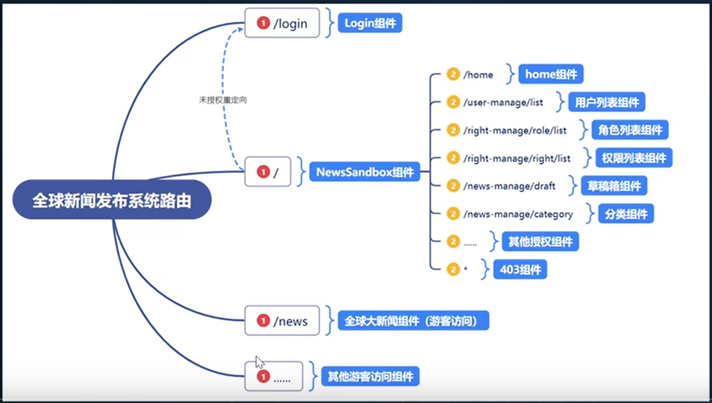

### 路由创建

1.下载路由 npm install --save react-router-dom@5

2.创建路由文件夹与容纳路由的文件(router文件夹与index.js路由文件)

3.设置路由 切记路由模式设置成Hash模式 Browser模式的话打包上线会有404(也可以打包项目时候修改 不影响项目开发)

4.设置路由模式

````jsx
import React, { Component } from 'react'
// 引用路由模式
import {HashRouter} from "react-router-dom"
export default class index extends Component {
  render() {
    return (
        // 设置路由模式
       <HashRouter>


       </HashRouter>
      
    )
  }
}

````

5.创建components 与 views 文件夹 并且创建登录页面 与 首页NewSandBox 路由页面与路由配置

6.设置基础页面权限

```jsx
import React, { Component } from 'react'
// 引用路由模式
import { HashRouter, Route, Redirect, Switch } from "react-router-dom"
import Login from "../views/login.jsx"
import NewSandBox from "../views/NewSandBox.jsx"
export default class index extends Component {
  render() {
    return (
      // 设置路由模式
      <HashRouter>
        <Switch>
          <Route path="/login" component={Login} />
          {/* 判断用户是否登陆过如果有那么就进入首页 否则 重定向到登录页面 */}
          {/* <Route path="/" render={() =>{return 判断用户是否登陆过 ? <NewSandBox /> : <Redirect to="/login" />*/}  
          <Route path="/" render={() =>{return localStorage.getItem("token") ? <NewSandBox /> : <Redirect to="/login" />
         } } />
        </Switch>

      </HashRouter>

    )
  }
}

```

## 3首页基本设置

下图大家会发现在首页中 左侧 与 右侧顶部 是不会变化的   右侧下面区域才是我们需要每次点击导航需要改变的内容所以我们可以使用二级路由来完成

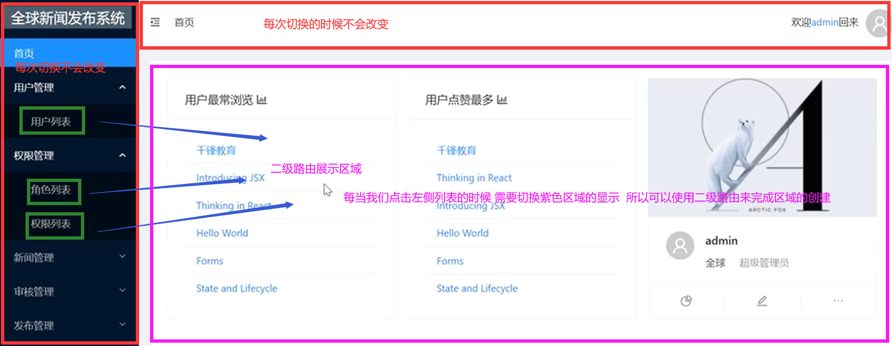1.创建左侧和右侧顶部的组件 在components下创建leftList.jsx与rightTop.jsx用来容纳

2.在首页NewSandBox.jsx中引用两个组件

````jsx
// 引用左侧与右侧顶部的组件
import LeftList from "../components/leftList.jsx"
import RightTop from "../components/rightTop.jsx"
let NewSandBox=()=>{
  return (
      <div>
           <div>
                {/* 使用 */}
                <LeftList />
                <RightTop />
      		</div>
      </div>
  )
}
export default NewSandBox

````

3.设置右侧下半部分的二级路由

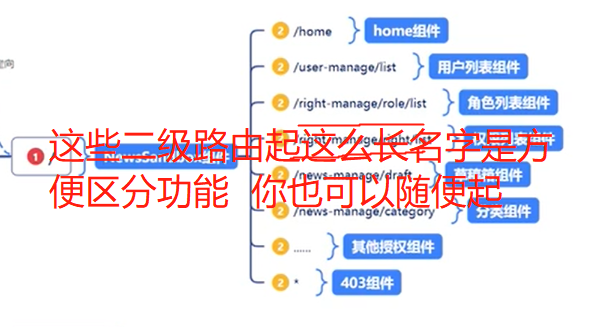

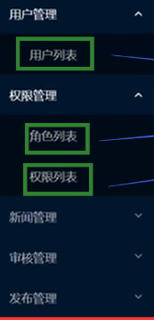

1.创建二级路由页面 分别为在views文件夹下

创建home文件夹 home.jsx(首页欢迎页面)  

创建user-manage文件夹并在其中创建list.jsx用户列表页面    

创建right-manage文件夹中新建 list.jsx 角色列表组件 roleList.jsx权限列表组件

创建no文件夹 no.jsx  404错误页面

2.配置路由规则 在NewSandBox.jsx中配置

```jsx
// 引用左侧与右侧顶部的组件
import LeftList from "../components/leftList.jsx"
import RightTop from "../components/rightTop.jsx"

// 引用二级路由页面
import Home from "./home/home.jsx"
import Rlist from "../views/right-manage/list.jsx"
import RoleList from "../views/right-manage/roleList.jsx"
import Ulist from "../views/user-manage/list.jsx"
import No from "../views/no/no.jsx"

import { Route, Switch, Redirect } from "react-router-dom"
let NewSandBox = () => {
  return (
    <div>
      <div>
        {/* 使用 */}
        <LeftList />
        <RightTop />

        {/* 配置二级路由规则 */}
        <Switch>
          <Route path="/home" component={Home} />
          <Route path="/user-manage/list" component={Ulist} />
          <Route path="/right-manage/list" component={Rlist} />
          <Route path="/right-manage/roleList" component={RoleList} />
          {/* 设置重定向保证第一次进入就显示欢迎页面home */}
          <Redirect from="/" to="/home" exact />
          {/* 在设置404错误页面 */}
          <Route component={No} />
        </Switch>
      </div>
    </div>
  )
}
export default NewSandBox

```

## 4.Antd使用

Antd 式蚂蚁集团 开发的一款企业级的后台pc端 React UI类库。 

官网：https://ant-design.gitee.io/index-cn

大家一定要记住   **文档在手 天下我有**


### 1.基本使用

1.下载： yarn add antd 或 npm install --save antd

2.根据文档提示 我们可以使用它的button组件	

```jsx
import React, { Component } from 'react'
// 引用指定内容
import { Button } from 'antd';
export default class Home extends Component {
  render() {
    return (
      <div>
          首页欢迎
          {/* 使用 */}
          <Button type="primary">Button</Button>
      </div>
    )
  }
}

```

3.设置样式antd样式 

**官方式这样说的：**

 修改 `src/App.css`，在文件顶部引入 `antd/dist/antd.css`

**但是我们可以：**

在views文件夹设置一个css 在其中引用antd的样式  

```css
@import '~antd/dist/antd.css';
```

并且把刚设置的css 在views下的index.js中引用

```jsx
import "./index.css";
```


到此antd就已经成功安装到我们的项目中了

### 2.layout布局

在官网中发现下面的布局很符合我们的要求

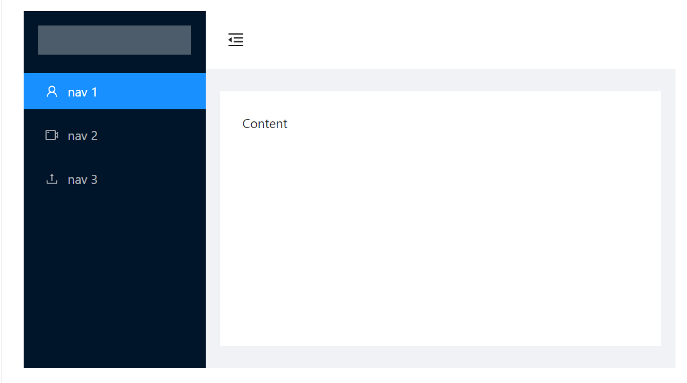

分析代码我们发现需要改造之前的内容

1.修改整体页面布局NewSandBox.jsx中 把最外层的div 修改成layout 标签 但是不要忘了引用

```jsx
xxxxxx
xxxxx
xxxx
// 引用
import { Layout } from 'antd';

let NewSandBox = () => {
  return (
    // 修改成Layout
    <Layout>
    xxxxxx
    </Layout>
  )
}
export default NewSandBox

```

2.设置左边导航修改Leftlist.jsx中设置

```jsx
// 不要忘了引用
import { Layout, Menu } from 'antd';

import { 
    UserOutlined,
    VideoCameraOutlined,
    UploadOutlined,
  } from '@ant-design/icons';
  
const { Sider } = Layout;


let LeftList = () => {
    return (
        <Sider trigger={null} collapsible >
         <div className="logo" ></div>
            <Menu theme="dark" mode="inline" defaultSelectedKeys={['1']}>
                <Menu.Item key="1" icon={<UserOutlined />}>
                    nav 1
                </Menu.Item>
                <Menu.Item key="2" icon={<VideoCameraOutlined />}>
                    nav 2
                </Menu.Item>
                <Menu.Item key="3" icon={<UploadOutlined />}>
                    nav 3
                </Menu.Item>
            </Menu>
        </Sider>
    )
}
export default LeftList
```

3.设置有测的布局容器 在NewSandBox.jsx设置右侧内容的容器为layout

````jsx
import LeftList from "../components/leftList.jsx"
import RightTop from "../components/rightTop.jsx"
// 引用二级路由页面
import Home from "./home/home.jsx"
import Rlist from "../views/right-manage/list.jsx"
import RoleList from "../views/right-manage/roleList.jsx"
import Ulist from "../views/user-manage/list.jsx"
import No from "../views/no/no.jsx"
// 引用左侧与右侧顶部的组件
import { Route, Switch, Redirect } from "react-router-dom"
// 引用
import "./NewSandBox.css"
import { Layout } from 'antd';
const {Content } = Layout;
let NewSandBox = () => {
  return (
    // 修改成Layout
    <Layout className="site-layout">
     
        {/* 使用 */}
        <LeftList />
		设置有测容器为Layout
        <Layout>
        	xxxxxxxx
        </Layout>
     
    </Layout>
  )
}
export default NewSandBox

````

4.设置右侧顶部在 rightTop.jsx中

```jsx
import React, { Component,useState } from 'react'
import { Layout } from 'antd';
import {
  MenuUnfoldOutlined,
    MenuFoldOutlined
  } from '@ant-design/icons';
  
// 但是Header还需要引用
const { Header } = Layout;
let RightTop=()=>{
    创建变量
  const [collapsed]=useState(false)
  return (
    <Header className="site-layout-background" style={{ padding: "0 16px" }}>
        
    {/* {React.createElement(this.state.collapsed ? MenuUnfoldOutlined : MenuFoldOutlined, {
      className: 'trigger',
      onClick: this.toggle,
    })} */}
    {
      collapsed?<MenuUnfoldOutlined/>:<MenuFoldOutlined/>
    }
  </Header>
  )
}
export default RightTop

```

5.使用content包裹路由设置内容   在NewSandBox中设置

````jsx
import LeftList from "../components/leftList.jsx"
import RightTop from "../components/rightTop.jsx"

// 引用二级路由页面
import Home from "./home/home.jsx"
import Rlist from "../views/right-manage/list.jsx"
import RoleList from "../views/right-manage/roleList.jsx"
import Ulist from "../views/user-manage/list.jsx"
import No from "../views/no/no.jsx"

// 引用左侧与右侧顶部的组件
import { Route, Switch, Redirect } from "react-router-dom"
let NewSandBox = () => {
  return (
    // 修改成Layout
    <Layout>
      <div>
        {/* 使用 */}
        <LeftList />

        <Layout className="site-layout">
          <RightTop />
          {/* 配置二级路由规则 */}
      {/* 使用content组件包裹路由  不要忘了上面引用*/}
          <Content
            className="site-layout-background"
            style={{
              margin: '24px 16px',
              padding: 24,
              minHeight: 280,
            }}
          >
           xxxxxxx

          </Content>
        </Layout>
      </div>
    </Layout>
  )
}
export default NewSandBox

````

6.引用样式在views下新建NewSandBox.css 并且在NewSandBox。.js中引用

````css
#components-layout-demo-custom-trigger .trigger {
    padding: 0 24px;
    font-size: 18px;
    line-height: 64px;
    cursor: pointer;
    transition: color 0.3s;
  }
  
  #components-layout-demo-custom-trigger .trigger:hover {
    color: #1890ff;
  }
  
  #components-layout-demo-custom-trigger .logo {
    height: 32px;
    margin: 16px;
    background: rgba(255, 255, 255, 0.3);
  }
  
  .site-layout .site-layout-background {
    background: #fff;
  }
````

NewSandBox中引用

````js
import "./NewSandBox.css"
````

完成如下效果

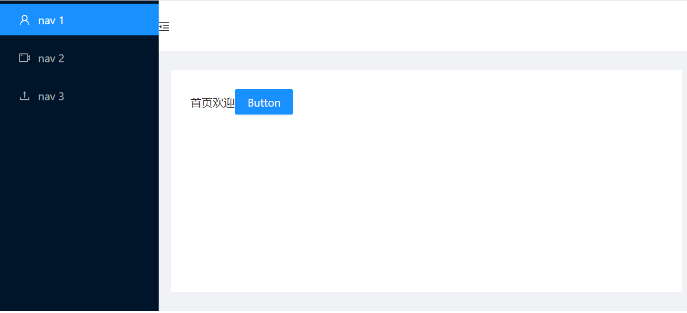

## 5.样式优化

1.设置页面高度100%；抓取后发现我们只需要把容器的height设置成100%即可

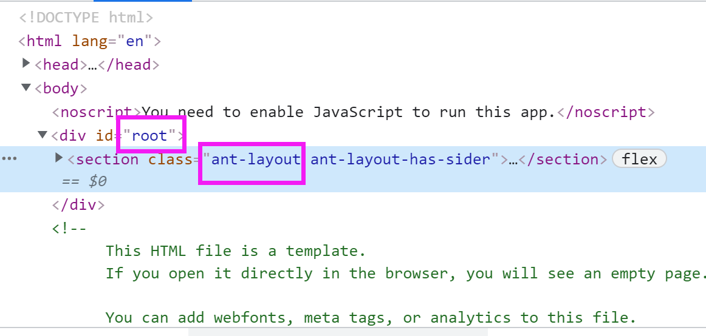

在NewSandBox.css中设置

```css
 #root,.ant-layout{
      height: 100%;
  }
```

2.设置右边header部分的图标部分rightTop中设置


```
  设置下padding的位置
  <Header className	="site-layout-background" style={{ padding: "0 16px" }}>
```

2.设置右边header部分的图标点击之后切换显示

```jsx
import React, { useState } from 'react'
import { Layout } from 'antd';
import {
  MenuUnfoldOutlined,
    MenuFoldOutlined
  } from '@ant-design/icons';
  
// 但是Header还需要引用
const { Header } = Layout;
let RightTop=()=>{
  const [collapsed,upcollapsed]=useState(false)
  // 修改下控制icon的变量取反
  let iconup=()=>{
    upcollapsed(!collapsed)
  }
  return (
    <Header className="site-layout-background" style={{ padding: "0 16px" }}>
        
    {/* {React.createElement(this.state.collapsed ? MenuUnfoldOutlined : MenuFoldOutlined, {
      className: 'trigger',
      onClick: this.toggle,
    })} */}
    {
      collapsed?<MenuUnfoldOutlined onClick={iconup}/>:<MenuFoldOutlined onClick={iconup}/>
    }
  </Header>
  )
}
export default RightTop
```

3.完成文字内容

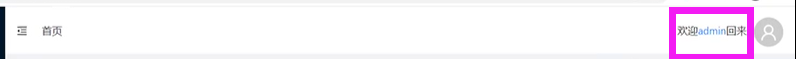

````html
<span style={{float:"right"}}>欢迎xx</span>
````

4.设置鼠标移入下拉框

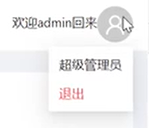

```jsx
import React, { useState } from 'react'
import { Layout, Menu, Dropdown, Avatar } from 'antd';
import { DownOutlined } from '@ant-design/icons';

import {
  MenuUnfoldOutlined,
  MenuFoldOutlined,
  UserOutlined
} from '@ant-design/icons';

// 但是Header还需要引用
const { Header } = Layout;
let RightTop = () => {
 xxxxxxxx

  let menu = (
    <Menu>
      <Menu.Item>
        11
      </Menu.Item>
      <Menu.Item>
        22
      </Menu.Item>
      <Menu.Item >
        33
      </Menu.Item>
      <Menu.Item danger>退出登录</Menu.Item>
    </Menu>
  );
  return (
    <Header className="site-layout-background" style={{ padding: "0 16px" }}>

    xxxxxx

      <div style={{ float: "right" }}>
        <span >欢迎xx</span>

        {/* 设置下拉框 不要忘了引用*/}
        <Dropdown overlay={menu}>
          <Avatar size="large" icon={<UserOutlined />} />
        </Dropdown>
      </div>

    </Header>
  )
}
export default RightTop
```

## 6设置左侧导航


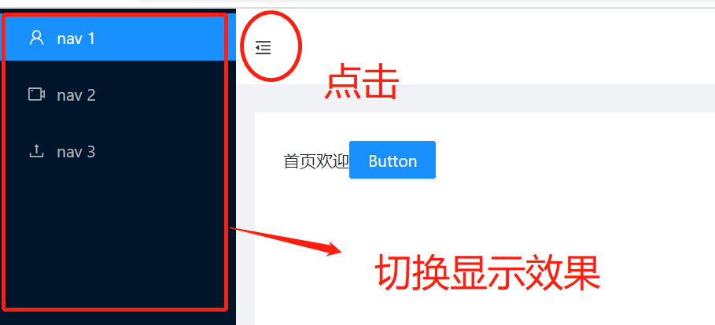


去文档找到siderhttps://ant-design.gitee.io/components/layout-cn/#Layout.Sider 会发现可以设置

collapsed 当前收起状态

````jsx
// 不要忘了引用
import { Layout, Menu } from 'antd';

import { 
    UserOutlined,
    VideoCameraOutlined,
    UploadOutlined,
  } from '@ant-design/icons';
  
const { Sider } = Layout;


let LeftList = () => {
    return (
        // 设置之后会发现左侧菜单样式
        <Sider trigger={null} collapsible collapsed={true}>
            <div className="logo" ></div>
            <Menu theme="dark" mode="inline" defaultSelectedKeys={['1']}>
                <Menu.Item key="1" icon={<UserOutlined />}>
                    nav 1
                </Menu.Item>
                <Menu.Item key="2" icon={<VideoCameraOutlined />}>
                    nav 2
                </Menu.Item>
                <Menu.Item key="3" icon={<UploadOutlined />}>
                    nav 3
                </Menu.Item>
            </Menu>
        </Sider>
    )
}
export default LeftList
````

设置左侧导航标题文字

```
// 不要忘了引用
import { Layout, Menu } from 'antd';

import { 
    UserOutlined,
    VideoCameraOutlined,
    UploadOutlined,
  } from '@ant-design/icons';
  
const { Sider } = Layout;


let LeftList = () => {
    return (
        // 设置之后会发现左侧菜单样式
        <Sider trigger={null} collapsible collapsed={false}>
            {/* 设置左侧导航标题文字 */}
            <div className="logo" >全球新闻发布系统</div>
          xxxxxxx
          xxxxxx
          xxxxxx
        </Sider>
    )
}
export default LeftList
```

设置文字样式并且不要忘了在组件中引用

在components中新建index.css

```css
.logo{
    line-height: 32px;
    color: white;
    background-color: rgba(255,255,255,.3);
    font-size: 18px;
    margin: 10px;
    text-align: center;

}
```

在组件中引用

```js
import { Layout, Menu } from 'antd';
// 引用样式
import "./index.css"
import { 
    UserOutlined,
    VideoCameraOutlined,
    UploadOutlined,
  } from '@ant-design/icons';
  
const { Sider } = Layout;
```

完成如下效果


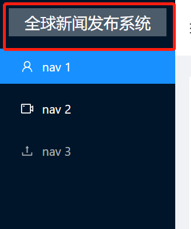

